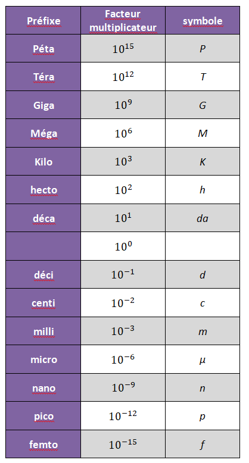

# Ecriture Scientifique

La notation scientifique est l’écriture d’un nombre sous la forme du
produit :
``` math
a\times10^n \quad \text{ ou noté aussi } \quad a\cdot10^n
```
avec $`a`$ un nombre décimal entre $`1`$ et $`10`$, et $`n`$ un nombre
entier positif ou négatif.

<div class="shaded">

**Exemple:**  
$`4807 \; m  \longrightarrow 4,807\cdot 10^{3}`$  
$`0,53\cdot 10^{-10} \; m \longrightarrow 5,3\cdot 10^{-1}\cdot 10^{-10} \; m= 5,3\cdot 10^{-11}\; m`$

</div>

# Chiffres significatifs

Dans l’écriture scientifique, les chiffres utilisés pour écrire le
décimal $`a`$ sont appelés chiffres significatifs.

Le rayon de la Terre est $`6,4\cdot 10^{3} \; km`$. On utilise deux
chiffres significatifs, ce qui signifie que le rayon de la Terre est
compris entre $`6,3\cdot 10^{3} \; km`$ et $`6,5\cdot 10^{3} \; km`$ ou
encore qu’il est égal à $`6400 \; km`$ à plus ou moins $`100 \; km`$.

Le nombre de chiffres significatifs utilisés pour exprimer une valeur
donnée indique la précision avec laquelle cette valeur est connue.
Exemple : dans le cas du rayon de la Terre, la précision est de
$`10^2 \; km`$.

Le résultat d’une multiplication ou d’une division ne doit pas avoir
plus de chiffres significatifs que la donnée qui en comporte le moins.
Exemple : longueur de l’équateur,
$`2\pi R = 2\times\pi6,4\cdot 10^{3} \; km = 4,0\cdot 10^{3} \; km`$.

Le chiffre zéro est significatif quand il n’est pas placé à gauche du
premier chiffre non nul.

<div class="shaded">

**Exemple:**

- Dans $`4,0\cdot 10^{4} \; km`$ il y a deux chiffres significatifs, car
  le *zéro en est un*.

- Dans $`0,4\cdot 10^{5} \; km`$ il y a un seul chiffre significatif,
  car le *zéro n’en est pas un*.

</div>

Les sciences physiques permettent de prévoir des résultats numérique
dans l’étude d’un phénomène, grâce au calcul. Ces résultats peuvent être
vérifiés par des expériences en effectuant une (ou des) mesure(s). Les
calculatrices peuvent fournir des résultats comportant beaucoup de
chiffres (8 ou plus) mais les appareils de mesure en donnent
généralement moins (3 ou 4). Il est donc **inutile** et **faux** de
donner un résultat avec tous les chiffres fournis par la calculatrice.

**Tous les résultats devront être donnés en *écriture scientifique* avec
*le bon nombre* de chiffres significatifs, suivis du *symbole de
l’unité* (sauf pour les quelques grandeurs qui s’expriment sans
unité).**

# Ordre de grandeur

L’ordre de grandeur d’un nombre très grand ou très petit est la
puissance de $`10`$ la plus proche de ce nombre. Un ordre de grandeur
permet de donner une idée de l’importance d’une grandeur.

<div class="shaded">

**Exemple:**

- Ordre de grandeur de $`4 807\;  m`$ : La puissance de 10 la plus
  proche de $`4,807`$ est $`1`$ (car compris entre $`0`$et $`5`$) donc
  l’ordre de grandeur de $`4807 \; m`$ est $`10^{3} \; m`$.

- Ordre de grandeur de $`80 422 \; m`$ : la puissance de $`10`$ la plus
  proche de $`8,0422`$ est $`10`$ (car compris entre 5 et 10) donc
  l’ordre de grandeur de $`80 422 \; m`$ est
  $`10\times 10^{4} = 10^{5} \; m`$.

- La distance Terre – Soleil est de *150 millions de km* : l’ordre de
  grandeur de cette distance est $`10^{11} \; km`$.

</div>

# Tracer une courbe 

Chaque courbe ou graphique que vous tracez doit avoir :

- Un titre sous-ligné

- Nom de la grandeur pertinente sur chaque axe ET son unité

  - axe des abscisses $`\rightarrow`$ grandeur indépendante.

  - axe des ordonnées $`\rightarrow`$ grandeur dépendante.

- Les graduations sur les axes

- l’échelle du graphique

- une légende distinguant les différentes courbes, s’il y en a
  plusieurs.

- les courbes linéaires doivent être tracées avec un règle.

<div class="shaded">

<div class="center">

**IMPORTANT : Il ne faut jamais simplement relier les points de données
afin d’obtenir une courbe.**

</div>

</div>

# Multiples, et sous-multiples d’une unité

<div class="center">



</div>

# Notions vues précédemment au collège

Quelques définitions que vous devez vous rappeler du collège :

- **Corps pur** : Un corps est pur s’il est composé d’une seule espèce
  chimiques, c’est à dire un seul type de matériau. L’eau pur est un
  exemple de corps pur.

- **Mélange** : est composé de deux ou plusieurs espèces chimiques
  différents. Le café au lait ou une vinaigrette sont des exemples de
  mélanges.

  - Un mélange est **homogène** si l’on ne distingue pas les différents
    constituants à l’oeil nu. L’air ou le café au lait sont des exemples
    de mélange homogène.

  - un mélange est **hétérogène** si l’on peut voir à l’oeil nu au moins
    deux des constituants du mélange. Une vinaigrette ou un un mélange
    sel et poivre sont des exemples de mélange hétérogènes.

Mais aussi quelques grandeurs physiques :

- **Masse volumique** : La masse volumique d’une espèce chimique est le
  quotient de la masse $`m`$ d’un échantillon de cette espèce chimique
  par son volume $`V`$).
  ``` math
  \rho = \dfrac{m}{V}
  ```
  Elle se note $`\rho`$ et s’exprime en kilogramme par mètre cube
  (symbole : $`kg\cdot m^{-3}`$. La masse volumique est une propriété
  importante d’une substance pure, car elle établit un lien entre sa
  masse et son volume, c’est à dire nous permet de savoir le volumique
  qu’occupe une masse donnée de la substance. La masse volumique est une
  propriété qui est influencée par la température. *Exemple : la masse
  volumique d’eau pure à température ambiante est
  $`\rho = 1000 \; kg\cdot m^{-3}`$, c’est à dire qu’un mètre cube d’eau
  possède une masse de $`1 \; tonne`$.*

- **Densité** : La densité d’une substance est une autre manière
  d’exprimer sa masse volumique. Il s’agit de donner le rapport/quotient
  de la masse volumique de la substance en question et la masse
  volumique d’eau:
  ``` math
  d = \dfrac{\rho_{substance}}{\rho_{eau}}
  ```
  la densité est une grandeur sans unité.

Des grandeurs physiques (comme la masse volumique) peuvent être
utilisées pour identifier une espèce chimique, mais il y en a d’autre
aussi que vous connaissez comme les températures de changement d’état
(température de fusion, température de vaporisation, etc).
