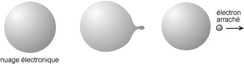
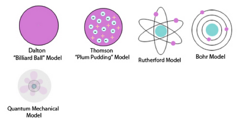
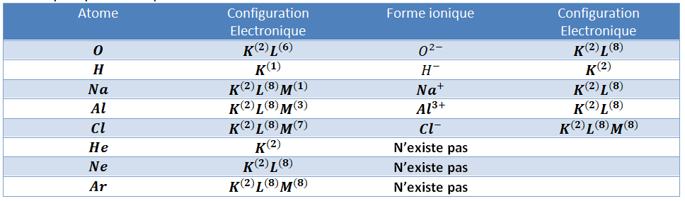

# Les électrons

## Un peu d’histoire

Comme d’habitude, un peu d’histoire. Voici l’évolution du modèle de la
structure électronique de l’atome :

- **J. J. Thompson et son modèle «
  Pouding »** : 

  Dans ce
  modèle, l’atome est composé d’électrons (que J.J. Thomson continuait à
  appeler« corpuscules », bien que George Stoney eut proposé la
  dénomination d’ électrons en 1894), plongés dans une « soupe » de
  charges positives pour équilibrer la charge négative des électrons,
  comme des prunes (plum en anglais) dans un pudding. Les électrons
  (comme nous les connaissons aujourd’hui) étaient considérés comme
  dispersés au sein de l’atome, mais avec de multiples structures
  possibles pour leurs positionnements, comme en particulier des anneaux
  tournants d’électrons. L’atome était parfois considéré comme ayant un
  nuage de charge positive plutôt qu’une soupe.

- **Earnest Rutherford et son modèle « Planétaire » :** 
- 
- l’atome est
  constitué d’un noyau positif autour duquel tournent des électrons
  négatifs. Entre le noyau - très petit par rapport à l’atome (environ
  $100 000$ fois) - et ses électrons, un très grand vide existe. Ce
  modèle fut très vite mis en défaut par les équations de Maxwell d’une
  part, qui prédisent que toute charge accélérée rayonne de l’énergie,
  et par les expériences montrant la quantification des niveaux
  d’énergie d’autre part. **Problème** : c’est un modèle basé sur la
  mécanique classique, et selon ses calculs les électrons seront captés
  immédiatement par le noyau, et l’atome n’aura aucune cohésion.

- **Niels Bohr et son modèle « Bohr-ring » :** Le premier modèle «
  quantique ». 
  
  Niels Bohr propose d’ajouter quelques contraintes :

  - L’électron ne rayonne aucune énergie lorsqu’il se trouve sur une
    orbite stable (ou orbite stationnaire). Ces orbites stables sont
    différenciées, quantifiées. Ce sont les seules orbites sur
    lesquelles l’ électron peut tourner.

  - L’électron ne rayonne ou n’absorbe de l’énergie que lors d’un
    changement d’orbite

  - Pour commodité de lecture, les orbites possibles de l’électron sont
    représentées dans la littérature comme des cercles de diamètres
    *quantifiés*.

- **Erwin Schrödinger et sa « fonction d’onde(=wave function) » :**
  
  Dans ce modèle, les électrons ne sont plus des billes localisées en
  orbite, mais des *nuages de probabilité de présence*. Cependant la
  représentation que l’on pouvait se faire d’un électron — une petite
  bille ? — était dictée par les formes observées dans le monde
  macroscopique, transposées sans preuves dans le monde *microscopique*.

  <figure>
  
  <figcaption>Image simplifiée de l’arrachement d’un électron du nuage
  électronique dans le modèle de Schrödinger. La notion de « trajectoire »
  n’est plus valable</figcaption>
  </figure>

  Ainsi dans ce modèle, contrairement à l’ancien modèle planétaire de
  l’atome, on ne considère plus que les électrons d’un atome sont en
  orbite circulaire (ou même elliptique) autour du noyau, mais occupent
  de manière probabiliste certaines régions de l’espace autour du noyau.
  Ces régions s’appelle les orbitales atomiques qui occupent différentes
  couches électroniques autour du noyau. On définit alors comme orbitale
  atomique une zone de l’espace où la probabilité de trouver un électron
  autour du noyau est de $≥95 \%$. Notre étude concerne ces couches
  électroniques.

## Répartition des électrons dans un atome
!!!success **Définition : *Couche électronique***  
On dit que deux électrons apparitennent à une même couche électronique

1.  Ils se trouvent, en moyenne, à une même distance du noyau

2.  Ou encore, ils sont également liés au noyau.
!!!

Pour les éléments avec $1 \leq Z \leq 18$ on représente chaque couche
électronique par une lettre : $K$, $L$, $M$ ; la couche $K$
étant la plus proche du noyau, et ainsi de suite.

Avec une meilleure compréhension de la structure des atomes, grâce à la
théorie quantique nous savons maintenant à l’**intérieur de ces couche
électronique**, il y a ce que nous appelons des ***sous-couches***
électronique. C’est comme dans chaque niveau énergétique ou se situent
les électrons il y a avait des sous-niveaux.

Comme pour les couches électronique il y a **nombre maximal d’électron
possible** dans chaque sous-couche. Les sous-couches s’appellent :
**$s$** et **$p$** (et pour les atomes au-delà de $Z=18$ il y a
aussi une sous-couche $d$, mais cela ne nous concerne pas). Dans le
premier niveau il n’y a qu’une seule sous-couche possible, une
sous-couche **$s$**. A partir du deuxième niveau il y a d’abord une
sous-couche **$s$** et puis une sous-couche **$p$**. Voici un
tableau pour montrer le nombre maximal d’électrons dans chaque niveau
énergétique d’un atome :

| Couche (niveau énergétique) | Sous-couche | nombre maximal d’électron |     |
|:---------------------------:|:-----------:|:-------------------------:|:---:|
|            1 (K)            |     1s      |             2             |  2  |
|            2 (L)            |     2s      |             2             |  8  |
|                             |     2p      |             6             |     |
|            3 (M)            |     3s      |             2             |  8  |
|                             |     3p      |             6             |     |

!!!warning **Remarque** : 
(*En fait chaque sous-couche, $s$ ou $p$ par exemple ne peut
contenir que 2 électrons, mais dans chaque niveau énergétique il y un
seul type de $s$ et trois types de sous-couches $p$, d’où le nombre
maximal de $2$ et $6$ respectifs pour les deux types de
sous-couches.*
!!!

En chimie, les électrons les plus importants, ceux qui déterminent la
construction des édifices chimiques, sont les **électrons périphériques,
ou électrons de valence**((= valence
electrons)), qui appartiennent à la couche externe (appelée
souvent la couche de valence((= valence
shell)) de l’atome.

## Les règles de remplissage des couches électroniques

En 1923, Wolfgang Pauli propose un principe (son fameux principe
d’exclusion) selon lequel les électrons ne peuvent pas se trouver au
même endroit dans le même état quantique((=
quantum state)) . Chaque couche (et sous-couche) électronique ne
peut contenir qu’un nombre limité d’électrons - comme vu dans la partie
précédente. Il y a donc une façon particulière pour remplir les
différents niveaux énergétique d’un atome, pour le nombre croissant
d’électrons des différents atomes.

!!! ***Règles de remplissages de couches électroniques : ***
- Il faut toujours commencer par le niveau énergétique le plus bas possible qui a de la place pour accueillir des électrons.
- Les électrons remplissent les couches d’une manière progressive;
  c’est-à-dire les électrons se placent d’abord dans la couche $1 - K$ ; puis, lorsque celle-ci est saturée((=
  saturated)) (atteint le nombre maximal permit) les électrons commence le remplissage de la couche $2 - L$, et ainsi de suite.
- A l’intérieur d’une couche, c’est la sous-couche $s$ qui est d’abord rempli avant de commencer à remplir la sous-couche $p$.
!!!

!!!light
**Exemple:** Voilà la configuration électronique de quelques atomes :

- Hydrogène $H$ ($Z=1$) : $1s^1$

- Lithium $Li$ ($Z=3$) : $1s^22s^1$

- Carbone $C$ ($Z=6$) : $1s^22s^22p^2$
!!!

==- Exercice d'application
!!!light $\triangleright \quad$

Configurations électroniques
Donner la configuration électronique pour les éléments suivants :

1.  Atome de Soufre ($S$) $Z=16$ :

2.  *ion* de Soufre ($S^{-2}$) :

3.  Atome de Sodium ($Na$) $Z=11$ :

4.  *ion* de Sodium ($Na^+$) :

5.  Atome d’Azote ($N$) $Z=7$ :

6.  Atome de Chlore ($C\ell$) $Z=17$ :
==-

### Pour ceux qui veulent aller plus loin ... 

En fait, d’après la théorie quantique chaque électron dans un atome est
caractérisé par 4 *nombres quantiques* :

- **Nombre principal** $n$ ((= principal
  quantum number)) : ce nombre correspond au *niveau énergétique*
  de l’électron dans l’atome. Les valeurs de $n$ est un entièes et
  strictement positives, c’est à dire : $n = 1, 2, 3, \ldots$ Un
  électron au deuxième niveau aurait un nombre $n=2$.

- **Nombre azimutal** $\ell$ ((= angular
  quantum number)): ce nombre correspond au sous-couche dans
  laquelle se trouve l’électron. Les valeur de $\ell$ sont entiers
  positifs, c’est à dire : $\ell = 0, 1, 2, \ldots, n-1$. Les
  sous-couches $s, p, \text{et }d$ correspondent a $\ell=0, 1, 2$.

- **Nombre magnétique** $m_\ell$ ((=
  mangetic quantum number)) : ce nombre correspond à
  "l’orientation" de la sous-couche concercée en trois dimension. Le
  nombre $m_\ell$ dépend du type de sous-couche, et prend des valeurs
  entières comprises entre $-\ell \ldots \ell$. La sous-couche $s$
  avec $\ell = 0$ n’a que $m_\ell = 0$ possible. La sous-couche
  $p$ avec $\ell = 1$ a trois orientations possibles :
  $m_\ell = -1, 0, 1$ d’où la limite de $6$ électrons max dans une
  sous-couche $p$.

- **Nombre magnétique de Spin** $m_S$ ((=
  spin quantum number)) : correspond au "sens de rotation" de
  l’électron. Il n’y a que deux possibilités pour le "spin" d’un
  électrons : $m_s = -\nicefrac{1}{2}, \nicefrac{1}{2}$. On peut
  l’imaginer (par analogie) au sens de rotation d’un tire-bouchon et le
  sens opposé. Ceci explique aussi la limite de $2$ électrons par type
  de sous-couche.

## Les électrons et la stabilité dans un atome

On a déjà rencontré la notion d’ion (en $3^{ème}$). Voici un petit
résumé :

1.  Les atomes sont, a priori, **électriquement neutres**, et donc ont
    le même nombre d’électrons et de protons. Mais ils peuvent
    **perdre** ou **gagner** des électrons, et par conséquent obtenir
    une charge électrique non-nulle.

2.  La forme chargée d’un atome s’appelle un **Ion**. Les ions positifs
    s’appellent **cations**, et les ions négatifs s’appellent
    **anions**.

3.  Un cation est **déficitaire** en électrons (d’où la charge
    positive), alors qu’un anion est **excédentaire** en électrons (d’où
    la charge négative).

Voici quelques exemples :

<figure>

</figure>

==- Exercice d'application
$\triangleright \quad$  
Y a-t-il quelque chose en commun
entre les différentes formes ioniques ?  
!!!
==-

Si l’on considère la configuration électronique, on voit que les formes
ioniques ont tous une **couche de valence saturée**. On dit que c’est la
configuration **la plus stable**.

De plus, on constate que les formes ioniques (stables) correspondent
exactement à la configuration électronique de certains éléments ($Z=2$
;$Z=10$ ;$Z=18$).

En fait, les trois gaz (Hélium, Néon, et Argon) font partie d’une
catégorie des éléments qui s’appellent les **Gaz Nobles**, (ou souvent
les Gaz Rares). On dit qu’ils sont chimiquement **inertes**, ou stable,
car ils ne participent que rarement à des réactions chimiques. Ils
existent naturellement sous forme d’**atomes isolés** et on ne les
rencontre ni sous la forme d’un ion ni dans des molécules. (Afin de
comprendre cette notion de stabilité il faut comprendre que les atomes «
**cherchent** » l’état le plus stable. Une espèce chimique qui est déjà
stable, n’a donc pas besoin de participer dans les réactions chimiques).
En chimie, le « **bonheur** » pour un atome est d’avoir la couche
externe saturée, et donc la recherche du « bonheur » les amène vers les
réactions chimiques qui produisent une configuration électronique comme
celle des gaz nobles :

!!!
Dans une entité chimique stable, les éléments adoptent la même structure
électronique que celle du gaz noble de numéro atomique le plus proche.  
!!!

Cela explique pourquoi, par exemple la forme ionique d’oxygène est
$O^{2-}$, et non $O^{-}$ : car la première forme donne la même
configuration que l’atome de néon $(1s^22s^22p^6)$. A l’exception des
gaz nobles, les éléments n’existent pas naturellement sous forme
d’atomes isolés, car sous cette forme ils ne sont pas stables.
