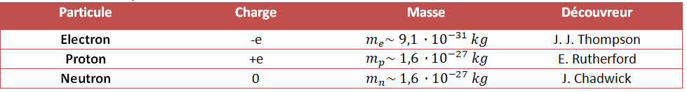

# L’atome

## Un peu d’histoire

**Démocrite** (vers 460-370 av. J.-C.), philosophe grec :
- Les « atomos » : particules de matière pure, minuscules, invisibles,
  indestructibles et infinies en nombre
- Le « vide », dans lequel se déplacent les atomos
- En grec : atomos = insécable (=unbreakable)

**Aristote** (vers 340 av. J.-C.), philosophe grec

- les éléments formeraient une masse continue, ce qui exclut l’existence
  du vide.
- conteste l’existence des atomos et son prestige est tel qu’il faut attendre le début du XIXème siècle pour que la théorie atomistique reprenne vie.

**John Dalton** (1805), physicien britannique
- Première théorie atomistique moderne

**J. J. Thompson** (1897), physicien britannique
- Découvre le premier composant de l’atome : l’électron

**Ernest Rutherford** (1910), physicien Néo-Zélandais
- Découvre le rayonnement Alpha et le noyau de l’atome

**James Chadwick**(1932), physicien britannique
- Découvre les autres composants de l’atome : le proton et le neutron

**Einstein, Planck, Bohr, Heisenberg** … (XXème siècle)
- Naissance de la théorie Quantique
## Le noyau atomique

On a déjà établi que l’échelle atomique (microscopique) a une structure lacunaire, c’est-à-dire qu’un atome est presque complètement vide. C’est le nouvel-zélandais Earnest Rutherford qui a mis en évidence la présence
d’un noyau atomique qui est positivement chargé. Mais il fallait attendre jusqu’à 1932, et les résultats de James Chadwick avant de
découvrir – ou plutôt confirmer - ‘la vraie structure’ du noyau, grâce à sa découverte du neutron.

!!!info
La théorie (ou modèle) atomique actuel dit que :

- L’atome est composé d’**électrons (-)** et d’un **noyau (+)**. La
  charge d’un électron est notée $\textbf{e}$. On peut considérer que
  le noyau a un rayon de l’ordre de $10^{-15} \; m$ , c’est-à-dire de
  l’ordre d’un *femtomètre* (fm).

- Le noyau est constitué de particules nommées **Nucléons**. Il existe
  deux sortes de nucléons : les **protons** et les **neutrons**.

- Le **proton est positivement chargé**, avec une charge égale à celle
  de l’électron.

- Le **neutron est électriquement neutre**.

- La **masse du proton**, qui est égale (à peu près) à celle du neutron,
  est **2000 fois plus grande** que celle de l’électron. Donc la **masse
  d’un atome est concentrée dans le noyau**.
!!!

Voici un tableau récapitulatif :

<figure id="fig:tableau 1">

<figcaption>propriétés des composants d’un atome, Où <em>e</em>= 1, 6 ⋅ 10−19 <em>C</em>
; (<em>C</em> = Coulomb, unité de
charge électrique)</figcaption>
</figure>

## Les nombres $A$ et $Z$

Les différents atomes sont caractérisés par le nombre de particules qui
constituent leurs noyaux. A cette fin on utilise les deux nombres
atomiques $Z$ et $A$ :

- $Z$ , qui s’appelle le **numéro atomique** (ou souvent numéro
  de charge), est le **nombre de protons** contenus dans le noyau

- $A$ , qui s’appelle parfois le **numéro de masse**, est le **nombre
  de nucléons** contenu dans le noyau (donc le nombre de protons PLUS le
  nombre de neutrons).

On représente le noyau de l’atome de façon symbolique, en utilisant son
symbole chimique (que l’on note X pour le cas général). En haut à gauche
du symbole, on fait figurer le nombre de nucléons A et en bas à gauche
le numéro atomique Z :

<figure>

<figcaption>représentation symbolique d’un noyau atomique </figcaption>
</figure>

==- Exercice d'applicationi
+++ Enoncé
$\triangleright \quad$**Exercice 1.**

1.  Hydrogène : 1 proton $\longrightarrow \quad _{1}^{1}H$

2.  Magnésium : 12 proton et 12 neutrons
    $\longrightarrow \quad _{12}^{24}H$

3.  Fer : 26 protons et 30 neutrons $\longrightarrow$

4.  Plomb : 82 protons et 208 nucléons $\longrightarrow$

5.  Uranium : $\quad  \quad \quad \quad  \quad \quad \longrightarrow$

$\triangleright \quad$**Exercice 2.** Peut-on déterminer le nombre de
neutrons grâce aux nombres atomiques?  

$\triangleright \quad$**Exercice 3.** Peut-on déterminer le nombre d’électrons avec les nombres $Z$ et $A$ ?  

+++ Solution Ex°1
+++ Solution Ex°2
+++ Solution Exo°3
+++
==-

On a appris (en 3ème) que les atomes sont **électriquement neutres**, sachant que
les protons et les électrons ont la même charge électrique (mais leurs
signes sont opposés). Donc Z donne le nombre d’électrons ainsi que de
protons.

$$
\text{La charge totale du noyau} =    Z \times e
$$
$$
\text{La charge totale des électrons} = - Z \times e
$$

En revanche, s’il s’agit d’un **ion**, on ne peut pas déterminer le nombre d’électrons sans savoir la charge de l’ion. On se rappelle qu’un
atome qui perd des électrons acquiert une charge positive et s’appelle un cation, alors qu’un atome qui gagne des électrons acquiert une charge
négative et s’appelle un anion. Alors, si l’on veut déterminer le nombre d’électrons d’un ion :

$$
\text{Numéro atomique -  nombre d'électrons }=  \text{charge de l'ion}
$$
$$
\text{Nombre d'électrons} = Z - \text{charge d'ion}
$$

==- Exercice d'application
+++ Enoncé
$\triangleright \quad$**Exercice 4.** Est-il possible d’avoir le même
atome avec un nombre de $Z$ ?  

$\triangleright \quad$**Exercice 5.** Est-il possible d’avoir le même
atome avec un nombre $A$ différent (et par conséquent un $N$
différent)?  
+++ Solution N°4
+++ solution N°5
+++
==- 

## Les isotopes

!!!success **Définition : *Isotope***

- Deux noyaux sont **isotopes** (l’un de l’autre) s’ils ont le même numéro atomique mais pas le même nombre de nucléons. Exemple :

L’élément Hydrogène a trois isotopes :
  $$ _{1}^{1}H \text{-- Hydrogène} \quad ; \quad _{1}^{2}H \text{-- Deutérium} \quad ;\quad _{1}^{3}H \text{-- Tritium}$$
!!!

L’« Eau lourde », utilisée dans les centrales nucléaires, est une
molécule d’eau qui contient des atomes de Deutérium (ou de Tritium) à la
place des atomes d’Hydrogène

Un exemple important est l’élément Uranium. Le numéro atomique de cet
élément est $Z = 92$ , mais on peut avoir des nombres de nucléons
différents. Les différents types d’uranium sont Uranium-235, U-237 , et
U-238. On dit qu’**il existe plusieurs isotopes d’Uranium**.

## La masse d’un atome

La masse des électrons est négligeable par rapport à celle des nucléons.
La masse de l’atome est donc concentrée dans son noyau. Par conséquent
la masse approchée d’un atome est égale à celle de son noyau. La masse
approchée m d’un atome peut s’exprimer :

$$
m = Z\cdot m_p + ( A - Z ) \cdot m_n \quad \text{où } m_p \text{est la masse du proton} et m_p \text{est la masse du proton}
$$

==- Exerice d'application
+++ Enoncé
$\triangleright \quad$ **Exercice 6.** Calculer la masse approchée de l’atome de fer.  
$\triangleright \quad$**Exercice 7.** Calculer la masse exacte de
l’atome de fer. 
+++ Solution N°6
+++ Solution N°7
+++
==- Exerice d'application
