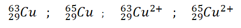

# Les éléments

!!!success **Définition : *Elément chimique***

- On donne le nom d’élément chimique à l’ensemble des particules (atomes
  ou ions) caractérisées par le nombre Z de protons dans leur noyau.
  Considérons l’exemple suivant :

- Dans les quatre cas, **l’atome ou l’ion contient 29 protons** dans le
  noyau, donc ils sont tous différents aspects du même élément.
!!!

==- [!button Exercice d'application]
+++ Enonce
$`\triangleright \quad`$ L’alchimie est une discipline
dont l’objet est l’étude de la matière et de ses transformations. L’un
des objectifs de l’alchimie est la grande œuvre, c’est-à-dire la
réalisation de la pierre philosophale (oui comme celle de Nicolas Flamel
dans Harry Potter), qui permet la transmutation des métaux comme le
plomb en or.

En vue de ce que l’on a appris dans ce chapitre, une telle transmutation
est-elle possible ? Pourquoi ? Comment ?
+++ Solution
+++
==-