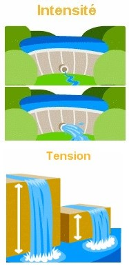
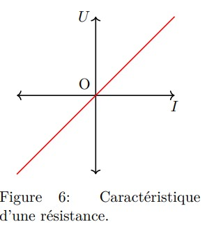
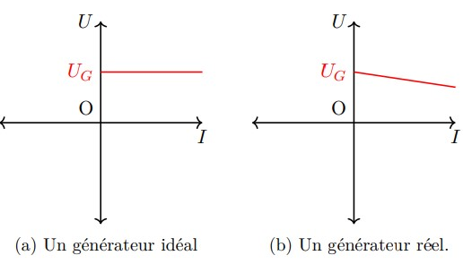

# Rappels (du collège)

Nous allons commencer par quelques rappels des notions sur les circuits
électriques que vous auriez du voir au collège. Il s’agit principalement
de définitions.

## Dipôles électriques

Les dispositifs que l’on voit au collège et au lycée sont presque
exclusivement des dipôles.

<table>
<caption>Un tableau récapitulatif des dipôles les plus fréquemment
utilisés.</caption>
<thead>
<tr>
<th style="text-align: center;">Pile</th>
<th style="text-align: center;"><div class="circuitikz">
<p>(0,0) to[battery1] (2,0);</p>
</div></th>
<th style="text-align: center;">Générateur</th>
<th style="text-align: center;"><div class="circuitikz">
<p>(0,0) to[vsource] (2,0);</p>
</div></th>
<th style="text-align: center;">Interrupter</th>
<th style="text-align: center;"><div class="circuitikz">
<p>(0,0) to[normal open switch] (2,0);</p>
</div></th>
</tr>
</thead>
<tbody>
<tr>
<td style="text-align: center;">Voltmètre</td>
<td style="text-align: center;"><div class="circuitikz">
<p>(0,0) – (0.5,0) ; (1,0) circle (0.5cm) node <span>V</span>;(1.5,0) –
(2,0);</p>
</div></td>
<td style="text-align: center;">Résistance</td>
<td style="text-align: center;"><div class="circuitikz">
<p>(0,0) to[generic] (2,0);</p>
</div></td>
<td style="text-align: center;">Lampe</td>
<td style="text-align: center;"><div class="circuitikz">
<p>(0,0) to[lamp] (2,0);</p>
</div></td>
</tr>
<tr>
<td style="text-align: center;">Ampèremètre</td>
<td style="text-align: center;"><div class="circuitikz">
<p>(0,-1) – (0.5,-1) ; (1,-1) circle (0.5cm) node
<span>A</span>;(1.5,-1) – (2,-1);</p>
</div></td>
<td style="text-align: center;">Diode</td>
<td style="text-align: center;"><div class="circuitikz">
<p>(0,0) to[diode] (2,0);</p>
</div></td>
<td style="text-align: center;">DEL</td>
<td style="text-align: center;"><div class="circuitikz">
<p>(0,0) to[led] (2,0);</p>
</div></td>
</tr>
<tr>
<td style="text-align: center;">Condensateur</td>
<td style="text-align: center;"><div class="circuitikz">
<p>(0,0) to[capacitor] (2,0);</p>
</div></td>
<td style="text-align: center;">Bobine (inducteur)</td>
<td style="text-align: center;"><div class="circuitikz">
<p>(0,0) to[cute inductor] (2,0);</p>
</div></td>
<td style="text-align: center;">Moteur</td>
<td style="text-align: center;"><div class="circuitikz">
<p>(0,0) – (0.5,0) ; (1,0) circle (0.5cm) node <span>M</span>;(1.5,0) –
(2,0);</p>
</div></td>
</tr>
</tbody>
</table>

<div class="leftbar">

**Définition : *Dipôle électrique***

- Un **dipôle** est un composant électrique avec une entrée de courant
  et une sortie, d’où l’appellation *di*pôle.

- Les dipôles tombent en deux catégories : générateur ou
  récepteur(<span style="color: purple">= electrical load</span>)

  - **Générateur** : Un dipôle qui **fournit l’énergie électrique** au
    circuit. Il le fait en convertissant une forme d’énergie en énergie
    électrique (générant ainsi une tension électrique entre ses bornes),
    et ce qui permet le courant électrique de circuler dans le circuit.

  - **Récepteur** : Un dipôle qui effectue un ’action’ grâce au courant
    électrique qui le traverse. Autrement dit, qui **convertit l’énergie
    électrique du circuit en une autre forme d’énergie**.

</div>

## Intensité du courant & Tension électrique

<div class="multicols">

2

<div class="leftbar">

**Définition : *Intensité du courant***

- L’intensité du courant, noté $`I`$ ou $`i`$, est une mesure de la
  **quantité de charge électrique (notée $`Q`$ ou $`q`$) qui passe
  devant un point du circuit en une seconde**, i.e. :
  ``` math
  I = \dfrac{Q}{\Delta t}
  ```

- L’intensité du courant s’exprime en *ampère* $`A=C\cdot s^{-1}`$.

- L’intensité se mesure grâce à un
  *ampèremètre*(<span style="color: purple">= ammeter</span>).

- Un ampèremètre est branché **en série** dans un circuit. Si branché en
  dérivation, cela fera un court-circuit.

</div>

<div class="leftbar">

**Définition : *Tension électrique***

- La tension électrique $`U`$ , est la **différence de potentiel
  électrique** $`V_A`$ et $`V_B`$ entre deux points différents (du
  circuit) :
  ``` math
  U_{AB} = V_B - V_A
  ```

- La tension s’exprime en $`Volts\; V`$.

- La tension électrique entre deux points d’un circuit se mesure grâce à
  un *voltmètre*.

- Un voltmètre est branché **en dérivation** par rapport aux deux
  points. Si branché en série, il se comporte comme un interrupteur
  ouvert.

</div>

</div>

<div class="wrapfigure">

r0.4 

</div>

<div class="mdframed">

**Remarque.** *Tandis que l’intensité du courant est une notion facile à
comprendre et à visualiser, la notion de tension électrique est plus
difficile à saisir, à première vue. D’une part, une analogie simple qui
permet de mieux voir l’intensité du courant serait de compter le nombre
de personnes qui passent devant un point pendant une période: plus il y
a de personnes qui passe, plus le *courant* est intense (ici les
*personnes* sont l’équivalent des électrons, par exemple, ou plus
généralement de la charge électrique).*

D’autre part la tension électrique est aux différence de potentiels
gravitationnels. Si nous mettons un ballons sur une terre plate, il ne
bougerait pas. Si on le met sur une légère pente, il commence à rouler
doucement vers le bas. Ceci est du à la différence de potentiel
gravitationnel, car la position de départ et de la fin ne sont pas à la
même hauteur, autrement dit aux différents potentiels gravitationnels.
Plus cette différence est importante, plus le ballon roule avec une
vitesse importante, et plus il peut surmonter, par exemple, les
obstacles sur son chemin. La situation est quasi-identique avec une
particule chargée dans un champ électrique. La tension générée par un
pile par exemple est la différence de potentiel électrique entre sa
sortie et son entrée. C’est cette différence qui donne l’impulsion aux
particules chargées pour se déplacer dans le circuit.

</div>

## Circuit électrique

Un circuit électrique est un ensemble de conducteurs et de dispositifs
électriques, reliés entre eux par des fils électriques. Un circuit
comporte, presque toujours, un ou plusieurs générateur qui est la source
de l’énergie électrique qui circule dans le circuits, et d’un ou
plusieurs récepteur qui reçoivent cette énergie électrique afin de le
convertir en une autre forme d’énergie (mécanique, ou thermique par
exemple.

### Le sens du courant

Un courant électrique est la manifestation des charges électriques qui
se déplace. Dans un solide ces charges sont des électrons qui se
déplacent dans le matériau conducteur (dans ce qu’on appelle la bande de
conduction). Mais dans un liquide (ou solution) ce sont des particules
chargées, autres qu’électrons, qui sont responsable pour le courant
électrique, des ions par exemple.

Les caractéristiques du courant, son sens et son intensité sont imposés
par le générateur. **A l’extérieure d’un générateur, le courant
électrique va de la borne $`+`$ vers la borne $`-`$ du générateur**.

<div class="center">

<div class="circuitikz">

(0,0) to\[battery1,\*-\*, v\<=$`U`$, i\<=$``$\] (3,0) ; (0.9,0.3)
node$`+`$; (2.1,0.3) node$`-`$;

</div>

<div class="circuitikz">

(0,0) to\[vsource,\*-\*, v\<=$`U`$, i\<=$``$\] (3,0) ; (0.9,0.3)
node$`+`$; (2.1,0.3) node$`-`$;

</div>

</div>

<div class="mdframed">

**Remarque.** *Nous savons que le courant est dû au mouvement des
électrons dans les fils. Or les électrons, négativement chargés, vont
vers le pôle $`+`$ du générateur. Cela veut dire que le sens de
circulation des électrons est de $`-`$ vers $`+`$, c’est à dire le sens
opposé au mouvement!*

La raison est plutôt historique : l’étude de l’électricité et de ses
propriétés date du $`XVIII^e`$ siècle, alors que l’électron n’a été
découvert qu’en 1897 (par J.J.Thompson). Toute la description des
courants électriques été basée donc sur l’idée que les porteurs de
charges étaient positivement chargés. Ce qu’on appelle aujourd’hui des
*trous*.

</div>

### Branchement en série & en dérivation

<figure>
<div class="circuitikz">
<p>(0,4) to[short, i=<span class="math inline"><em>i</em></span>] (2,4)
to [R, i=<span class="math inline"><em>i</em><sub>1</sub></span>,
l=<span class="math inline"><em>R</em><sub>1</sub></span>] (2,0) ; (2,4)
– (4,4) to[R, l=<span class="math inline"><em>R</em><sub>2</sub></span>,
i=<span class="math inline"><em>i</em><sub>2</sub></span>] (4,0) – (0,0)
; (2,4) circle (1pt) ; (2,0) circle (1pt) ; (0,4) circle (1pt) ; (0,0)
circle (1pt) ;</p>
</div>
<div class="circuitikz">
<p>(0,4) to[short, i=<span class="math inline"><em>i</em></span>] (2,4)
to[R, i=<span class="math inline"></span>, l=<span
class="math inline"><em>R</em><sub>1</sub></span>] (2,2) to[R, l=<span
class="math inline"><em>R</em><sub>2</sub></span>] (2,0) to[short,
i=<span class="math inline"></span>] (0,0) ; (0,4) circle (1pt) ; (0,0)
circle (1pt) ;</p>
</div>
<figcaption>Branchement en dérivation à gauche, en série à
droite</figcaption>
</figure>

### Conventions récepteur & générateur

Comme nous l’avons déjà mentionné, un générateur fournit l’énergie
électrique au circuit, tandis que les récepteur la consomme, ou
convertissent en une autre forme. Ceci se manifeste en une variation du
potentiel électrique opposée entre les récepteurs et les générateurs.
Autrement dit un générateur augment la différence de potentiel
électrique, et un récepteur diminue le potentiel électrique. La tension
entre les bornes d’une générateur n’a pas le même signe que la tension
entre les bornes d’un récepteur, comme on va voir.

<div class="wrapfigure">

r0.4

<div class="circuitikz">

(0,0) to\[lamp,\*-\*, i\<=$``$, v^=$`U_R`$\] (3,0) ;

</div>

<div class="circuitikz">

(0,0) to\[battery1,\*-\*, v\<=$`U`$, i\<=$``$\] (3,0) ; (0.9,0.3)
node$`+`$; (2.1,0.3) node$`-`$;

</div>

</div>

Dans représentation symbolique des diagrammes de circuit, ceci est est
traduit par le sens de la flèche indiquant la tension du dipôle. Nous
parlons alors de la convention générateur, et convention récepteur.

- **Convention générateur** : le sens de la flèche de la tension est le
  même que celui du courant.

- **Convention récepteur** : le sens de la flèche de la tension est
  opposé au celui du courant.

<div class="shaded">

**Exemple:**

<div class="wrapfigure">

r0.35

<div class="center">

<div class="circuitikz">

(0,3) to\[battery1, i=$`i`$\] (0,0); (0,3) – (3,3) to\[lamp,
i=$`i`$\](3,0) – (0,0); (1.5,3) circle \[radius=0.05\]; (1.5,0) circle
\[radius=0.05\]; (1.5,0.2) – (1.5,2.8); at (1.5,1.5) $`U`$;

</div>

</div>

</div>

Considérons le circuit très simple ci-contre. Il s’agit d’un générateur
et un récepteur, ici une lampe.

La tension entre deux points d’un circuit est toujours la même $`U`$. On
voit donc que du point de vu du générateur cette tension est dans le
même sens que le courant, tandis que pour le récepteur cette tension va
au sens opposé au courant. Voici donc les conventions générateur et
récepteur.

</div>

# Les Lois de Kirchoff

Nous avons vu au collège qu’il existe principalement deux types de
circuits : **en série** (avec une seule boucle, ou **une seule
maille**), et **en dérivation** (avec **plusieurs boucles ou mailles**).

Les lois qui nous disent comment la tension et l’intensité du courant se
comportent dans des différents types de circuits, s’appellent les lois
de Kirchoff (<span style="color: purple">= Kirchoff’s circuit
laws</span>), d’après l’allemand Gustav Kirchoff :

- **$`1^{ère}`$ loi de Kirchoff** : Loi des mailles, concernant la
  division de la tension dans une maille.

- **$`2^{ème}`$ loi de Kirchoff** : Loi des noeuds, concernant la
  division du courant dans un noeud.

## Loi des Mailles

<div class="shaded">

**Dans chaque maille d’un circuit, la somme algébrique des tensions de
tous les dipôles de la maille est toujours zéro.**

</div>

<div class="wrapfigure">

r0.4

<div class="center">

<div class="circuitikz">

(0,4) to\[V, v\<=$`U_G`$, i\<=$`i`$\] (0,0) ; (0,4) –(1,4) to \[R,
l^=$`R_1`$, v\<=$`U_1`$, i=$`i`$\] (3,4) – (4,4) – (4,3) to\[R,
l^=$`R_2`$, v\<=$`U_2`$\](4,1) – (4,0) – (3,0) to \[R, l^=$`R_3`$,
v\<=$`U_3`$\] (1,0) – (0,0);

</div>

</div>

</div>

Dans le circuit ci-contre, d’après la loi des mailles on doit avoir la
somme de toutes les tensions égale à $`0`$. Mais d’après la convention
générateur, comme nous voyons sur le schéma le sens de la tension
$`U_G`$ est opposé aux autres tension, et donc on en arrive à la
relation :
``` math
\begin{aligned}
    0 &=-U_G + U_1 + U_2 + U_3  \\
    U_G &= U_1 + U_2 + U_3
\end{aligned}
```

Si l’on voulait interpréter le sens de cette relation, ou de la loi des
mailles, on peut tout simplement dire que la tension générée par le
générateur est égale à la somme des tension utilisée par les récepteur.
Autrement, l’énergie consommée par l’ensemble des récepteurs est égale à
l’énergie fournie par l’ensemble des générateurs.

## Loi des Noeuds

<div class="shaded">

**Dans chaque noeud d’un circuit électrique, la somme algébriques des
intensités du courant entrant et sortant du noeud, est toujours nulle.**

</div>

<div class="wrapfigure">

r0.2 

</div>

Dans la figure ci-contre on voit un noeud quelconque dans un circuit. On
voit clairement qu’il y a deux courant qui entrent dans le noeud, et
deux qui sortent. D’après la loi des noeuds donc, la somme de ces quatre
intensités doit être nulle.

Mais il faut respecter le signe algébrique de chaque courant, c’est à
dire quand le courant entre $`i>0`$, et quand le courant sort $`i<0`$.
La relation mathématique relevant de la loi des noeuds est donc :
``` math
\begin{aligned}
    i_1 + i_2 - i_3 - i_4 &= 0 \\
    i_1 + i_2 &= i_3 + i_4
\end{aligned}
```

Ce résultats, et la loi des noeuds, est plutôt facile à interpréter.
L’intensité du courant est une mesure du débit de charge électrique.
Dans ce cas-là dit simplement qu’autant de charge sort d’un noeud, qui y
entre, et l’inverse.

<div class="mdframed">

**Remarque.** *Les deux lois de Kirchoff sont les manifestations de deux
principes fondamentaux et importants de la physique. La loi des mailles
est une conséquence du principe de la conservation de l’énergie, et la
loi des noeuds est une conséquence du principe de la conservation de la
charge.*

</div>

# Caractéristique d’un dipôle

Une des manières la plus courante d’étudier le comportement d’un dipôle
électrique, est grâce à sa **courbe caractéristique**
(<span style="color: purple">= current-voltage characteristic</span>)
(parfois appelé simplement sa *caractéristique*).

Il s’agit d’un graphique qui montre l’évolution de la tension $`U`$
entre les bornes du dipôle en fonction de $`I`$, l’intensité du courant
qui le parcourt (i.e. le graphique $`U=f(I)`$). Dans certains livre la
caractéristique peut être donnée comme $`I=f(U)`$. Cela n’est qu’un
changement de représentation, et ne change pas le fond de ce que la
caractéristique révèle.

## Conducteur Ohmique

<div class="wrapfigure">

r0.25 

</div>

Vous connaissez déjà le conducteur ohmique depuis la classe de
quatrième. C’est le dipôle récepteur le plus simple que vous avez
rencontré, avec le symbole

<div class="circuitikz">

(0,0) to\[ R \] (2,0);

</div>

.

Le conducteur ohmique est la catégorie des dipôles ayant un comportement
caractérisé par la courbe caractéristique ci-contre. Autrement dit, tous
dipôles ayant une tension qui varie de manière linéaire en fonction de
l’intensité du courant.

## La loi d’Ohm

La variation de $`U`$ en foncions de $`I`$ étant linéaire, on peut le
modéliser mathématiquement par une fonction du type $`y = m\cdot x`$, où
$`m`$ est le coefficient directeur du graphique précédent, c’est à dire
la constante de proportionnalité entre la tension $`U`$ et l’intensité
$`I`$. Dans notre modélisation donc l’ordonnée $`y`$ correspond à la
tension $`U`$, et l’abscisse $`x`$ correspond à l’intensité $`I`$, ce
qui donne une loi que vous connaissez déjà : La loi d’Ohm.

Avec $`R`$ comme constante de proportionnalité.

<div class="leftbar">

**Définition : *Loi d’Ohm***

- La loi d’Ohm est une loi empirique liant l’intensité du courant
  traversant un conducteur ohmique, et la tension entre ses bornes.

- Elle s’exprime mathématiquement :
  ``` math
  U = R\cdot I
  ```

- La constante de proportionnalité $`R`$ s’appelle la résistance du
  conducteur ohmique, et est une mesure, justement, de la résistance à
  l’intérieur du conducteur, au passage du courant électrique.

- $`R`$ s’exprime en *ohm*, noté par le symbole $`\ohm`$ (omega
  majuscule).

</div>

## Le générateur

<div class="wrapfigure">

l0.5 

</div>

Nous n’allons pas entrer trop en détails cette année des différents
types de générateur que l’on peut avoir (e.g. générateur de tension
idéal, générateur de courant idéal, etc.), mais l’essentiel ne change
pas : un générateur doit fournir l’énergie électrique au circuit, et est
caractérisé par une tension qui doit rester plus ou moins constante et
stable.

Nous faisons la distinction entre un générateur **idéal** et un
générateur **réel**. C’est d’ailleurs une distinction que nous faisons
souvent. La **différence entre un dipôle réel et idéal est la présence
d’une petite résistance interne**. Un dipôle idéal, est tel, car on
suppose qu’il n’y a aucune résistance au passage du courant à son
intérieur, tandis que dans le monde réel, tout dipôle possède une
certaine résistance interne, même si elle peut être très faible.

Un générateur idéal arrive à maintenir la tension qu’il génère, alors
qu’un générateur réel, perd une partie de l’énergie qu’elle produise en
raison de cette résistance interne. La tension générée par un générateur
réel, selon la courbe caractéristique ci-contre est de forme :

``` math
U = U_G - r\cdot I \quad \quad
\begin{cases}
r \text{ est la résistance interne du générateur}\\
U \text{ est la tension réelle fournie par le générateur}\\
U_G \text{ est la tension idéale (nominale) du générateur}\\
I \text{ est l'intensité du courant qui parcourt le générateur}
\end{cases}
```

## Le point de fonctionnement

Nous pouvons maintenant utiliser toutes les informations précédente afin
de déterminer dans quel étant fonctionnerait notre circuit. Étant donné
que dans un circuit simple (caractérisé par les courbes ci-contre), il
faut la même tension électrique et intensité du courant dans le
générateur que dans le dipôle ohmique y branché, le circuit
fonctionnerait à l’intersection des deux caractéristiques. Ce point est
nommé le **point de fonctionnement**. L’intensité du fonctionnement
$`I_f`$ est donc l’intensité du courant qui circulerait dans le circuit,
et la tension du fonctionnement $`U_f`$ serait la tensions entre les
bornes du générateur et du récepteur.

<figure>

<figcaption>Détermination graphique du point de
fonctionnement.</figcaption>
</figure>

Cette analyse est parfaitement valable pour des circuits encore plus
compliqué, comportant par exemple plusieurs conducteurs ohmiques.
