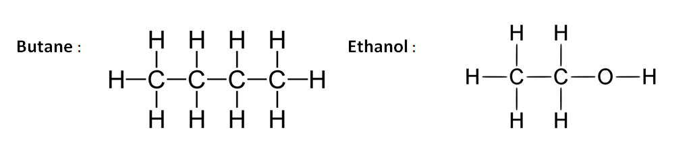
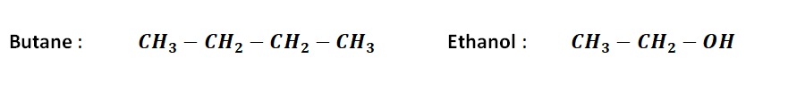
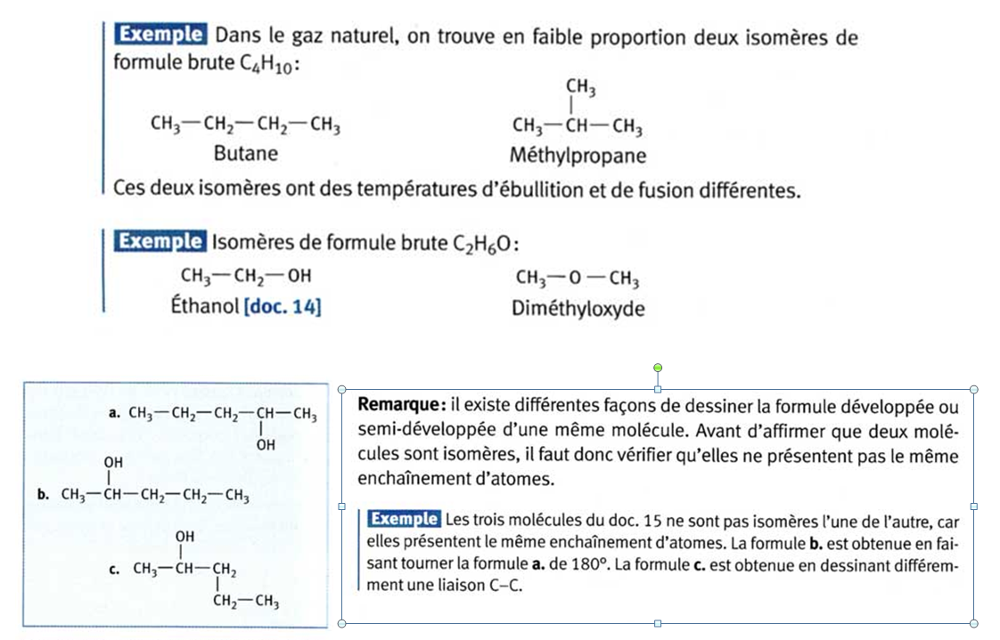

# Isomérie

On a déjà rencontré la notion de la formule brute d’une molécule. Mais,
assez souvent (surtout quand on rencontrera les grosses molécules
organiques), on a besoin de plus d’information sur la structure des
liaisons covalentes et la forme générale de la molécule. Voici donc
trois définitions importantes :

!!!success **Définition : *Formules chimiques***

**Formule Brute** : La formule brute indique les atomes présents dans la
molécule et leurs nombres. Exemple :

$$\text{Butane} \quad \quad\quad C_4H_{10} \quad \quad \quad \quad ;     \quad \quad \quad \text{Ethanol   }\quad \quad \quad C_2H_6O$$

**Formule développée** : Une formule développée fait apparaître l’ensemble des
atomes d’une molécule et liaisons covalente qui les relient. Exemple :

**Formule semi-développée** : La formule semi-développée n’indique pas
les liaisons avec les atomes d’hydrogène. Les symboles de ces atomes
sont groupés avec ceux des atomes auxquels ils sont liés. Exemples :

!!!

==- [!button Exercice d'application]
+++
$\triangleright \quad$**Exercice .** Considérez la formule brute de
butane. La formule développée propose ci-dessus, est-elle la seule
possible ?
+++
==- 

!!!success **Définition : *Isomère***  
Deux molécules sont des **isomères** si elles ont une **même formule
brute, mais des enchaînements d’atomes (i.e. formules développées)
différents**.

