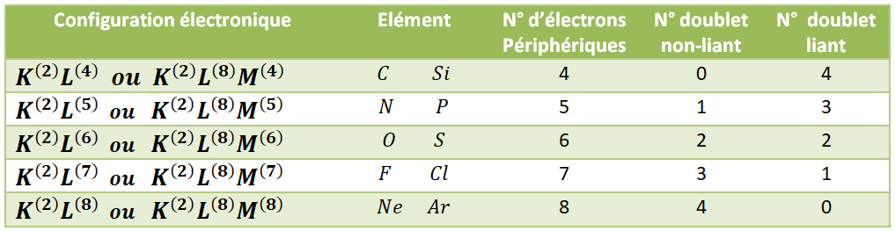
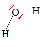
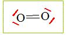
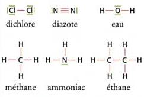

# Représentation de Lewis et la liaison covalente

Afin de visualiser la structure électronique de la couche externe d’un
atome, le chimiste américain Gilbert N. Lewis développa une
schématisation simple :

- Les noyaux et les couches internes des atomes sont représentés par les
  symboles des éléments chimiques correspondants.

- Les liaisons covalentes (**doublets liants**) sont représentées par un
  **trait entre les atomes** liés.

- Les **doublets non-liants** sont représentés par des **traits autour
  du symbole**.

Il faut satisfaire la règle de l’octet. Or chaque tiret représente deux
électrons, donc chaque atome doit être entouré par 4 traits, y compris
les doublets liants et non-liants.

<figure>

</figure>

**Exemple:** Dans la molécule d’eau, $H_2O$ (figure
<a href="#fig:eau" data-reference-type="ref"
data-reference="fig:eau">1</a> ci-après), l’oxygène, qui possède 6
électrons périphériques, engage deux électrons dans des liaisons
covalentes, un avec chaque atome d’hydrogène. Il lui reste 4 électrons,
non engagés dans une liaison, sur sa couche externe. Ils s’associent en
deux doublets Non-liants (tirets
rouges). Voici l’atome de dioxygène (figure
<a href="#fig:O2" data-reference-type="ref"
data-reference="fig:O2">3</a> ci-après) (dans l’air, et nécessaire pour
la vie) :

<figure id="fig:O2">
<figure id="fig:eau">

<figcaption>Molécule d’eau</figcaption>
</figure>
<figure id="fig:O2">

<figcaption>Molécule de dioxygène</figcaption>
</figure>
<figcaption>Molécule de dioxygène</figcaption>
</figure>

**Exemple:** Cyanure d’hydrogène, appelé aussi Acide cyanhydrique
(toxique pour l’homme, utilisé dans les pesticides et des fumigateurs).

<figure id="fig:cyan">

<figcaption>Molécule de cyanure d’hydrogène</figcaption>
</figure>

Remarquons le cas du Cyanure d’hydrogène (ainsi que du dioxygène), la
présence de plusieurs liaisons entre l’atome de carbone, et l’atome
d’azote. Comme expliqué précédemment, chaque trait représente deux
électrons partagés, le carbone et l’azote partage donc, au total, 6
électrons. **Une liaison covalente multiple est constituée de deux ou
trois liaisons covalentes entre deux atomes.**

Les étapes à suivre pour la construction du diagramme de Lewis :

1.  Déterminer le nombre d’électrons périphérique x de la molécule .

2.  Déterminer le nombre de doublet n : $n=\dfrac{x}{2}$

3.  Déterminer le nombre de liaisons possible pour chaque atomes.

4.  Repartir les n doublets de manière à ce que chaque atome satisfasse
    les règles de duet et de l’octet.

**Exemple:** Voici les structures de quelques molécules simples :

dichlore : $C\ell_2$ ; diazote : $N_2$ ; eau : $H_2O$ ; méthane :
$CH_4$ ; ammoniac : $NH_3$ ; éthane : $C_2H_6$  

<figure>

</figure>

$\triangleright \quad$**Exercice .** Refaire les diagrammes de Lewis a
partir des diagrammes avec les points représentants les électrons
périphérique.

