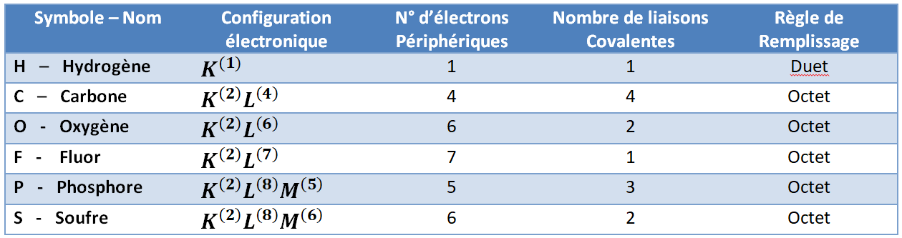

# Les molécules

!!!success **Définition : *Molécule***  
Une **molécule** est une **association stable d’atomes**, qui est
**électriquement neutre**. On représente chaque molécule par une
**formule brute**, qui traduit sa composition.
!!!

!!!light **Exemple:** 
* Acide Sulfurique : $H_2SO_4$ 
* Eau : $H2O$ 
* Carbon dioxide : $CO2$
!!!

Si la possibilité de simplement gagner ou perdre des électrons n’existe pas (pour former des ions), alors, les atomes vont essayer de partager
des électrons entre d’eux, afin de trouver une configuration électronique stable. Ce mis-en-commun des électrons s’appelle une
**liaison chimique**, ou plus précisément une **liaison covalente**.

## Liaisons covalentes

!!!success **Définition : *Liaison covalente***

- Une liaison covalente entre deux atomes correspond à la mise en commun
  de deux électrons périphériques. En formant des liaisons covalentes,
  chaque atome s’entoure des électrons requis pour respecter la règle de
  l’octet (ou du duet pour l’hydrogène et le lithium). Dans les
  molécules donc, les atomes sont plus stables que s’ils étaient isolés.

- La liaison formée entre deux atomes (i.e. les deux électrons partagés
  par les atomes) s’appelle un doublet liant. Le doublet liant est
  considéré comme appartenant entièrement à chacun des deux atomes liés.

- Les électrons périphériques qui ne sont pas engagés dans une liaison
  covalente s’associent deux par deux pour former des doublets
  non-liants, autour de l’atome.
!!!

---
!!!success **Définition : *Energie de liaison***

- L’énergie de liaison est la quantité d’énergie nécessaire pour
  *briser* une liaison covalente.

- Elle s’exprime comme la quantité d’énergie (en Joules) nécessaire pour
  briser **une mole de molécule** en atomes qui la constituent.

- Il s’agit d’une mesure de la force d’une liaison, plus la liaison est
  forte, plus il faut de l’énergie pour la briser.
!!!

 

!!!warning **Remarque.**

Cette énergie de liaison est, en effet, l’énergie qui est libérée quand
on transforme des molécules, notamment dans les réaction exothermique,
et les réactions ou une *macromolécules* est transformée en des
molécules plus petites.

Une exemple très parlant de ca est le métabolisme. Nous vivons de
l’énergie du métabolisme des molécules comme le glucose. Cette molécule
a une formule brute de $C_6H_{12}O_6$ Lors des différentes étapes de
la digestion de cette molécules les différentes liaisons entre les
carbones, entre carbone et hydrogène et entre carbone et carbone et
oxygène sont brisées et leurs énergie libérée. Le produit de cette
transformation est des molécules d’eau et de dioxyde de carbone .

Il est intéressant de noter que ce processus et l’exacte inverse de la
photosynthèse, pendant lequel les molécules d’eau et de dioxyde de
carbone sont rassembler afin de former des molécules de glucose. La
formation des liaisons de la molécule de glucose nécessite de l’énergie,
cette énergie provenant de la lumière du soleil, captée et utilise par
les molécule de chlorophyll.

L’énergie qui vous permet de rester vivant est *litéralement* l’énergie
du soleil!
!!!

En connaissant maintenant la nature des liaisons covalentes, peut-on
déterminer le nombre de liaison covalente nécessaire pour chaque atome ?
La réponse est oui!

!!!info
Pour un élément le nombre de liaisons covalentes à former est égal au
nombre d’électrons manquants sur la couche externe de l’atome isolé pour
obéir aux règles du duet et de l’octet.

Considérons les cas suivants :

- l’élément $N$ (azote) avec $Z=7$. Cet élément a une configuration
  électronique de $K^{(2)}L^{(5)}$. Pour obéir la règle de l’octet, il
  lui manque $3$ électrons. L’azote forme donc $3$ liaisons
  covalentes.

- l’élément $Cl$ (chlore) avec Z=17. Cet élément a une configuration
  électronique de $K^{(2)}L^{(8)}M^{(7)}$. Pour obéir la règle de
  l’octet, il lui manque $1$ électrons. L’azote forme donc $1$
  liaison covalente.

Voici un tableau de quelques éléments et le nombre de liaisons
covalentes :

