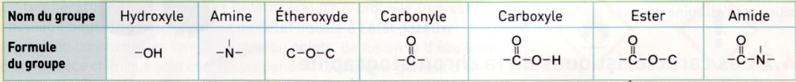
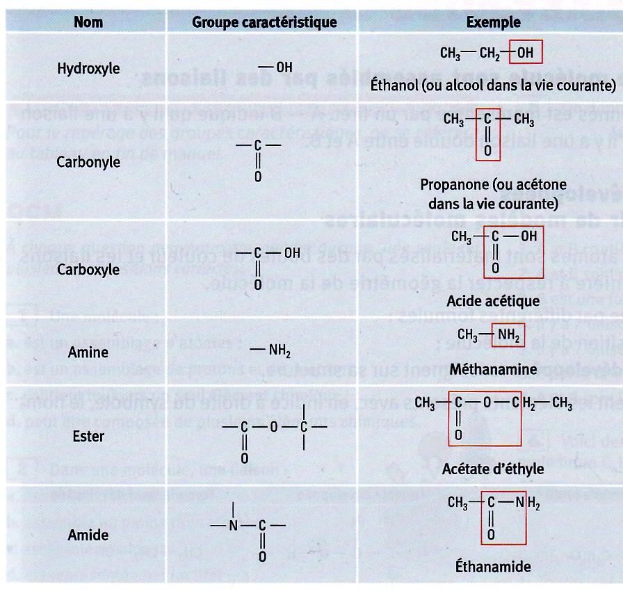
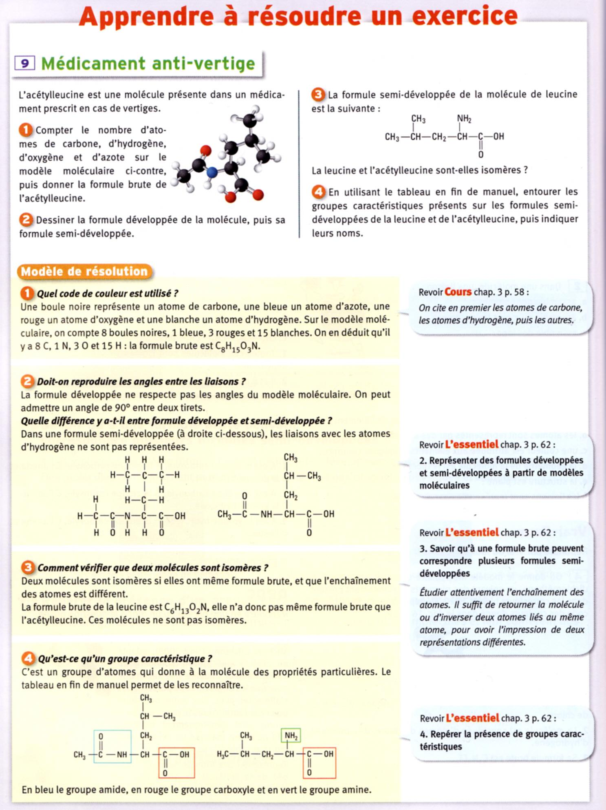
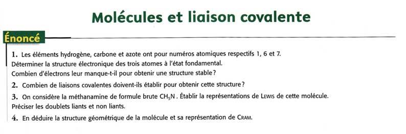
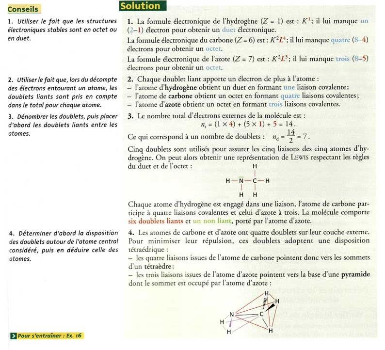

# Molécules organiques et groupes caractéristiques

La chimie organique est l’étude chimique des molécules présentes et
essentielle à la vie, et aux organismes vivants. Les éléments principaux
de ces molécules sont carbone $C$, hydrogène $H$, oxygène $O$, et
azote $N$.

Une molécule organique est constituée d’une chaîne d’atomes de carbones,
appelée le squelette ou chaîne carbonée, sur laquelle sont fixés
d’autres atomes et groupes d’atomes.

Déjà, le nom de la molécule dépend de nombre d’atome de carbone dans la
chaîne principale (la chaîne la plus longue).

| Nombre de carbon | nom/préfixe |        exemple        | formule semi-développée |
|:-----------------|:-----------:|:---------------------:|:------------------------|
| 1                |    méth-    |    méthane, méthyl    |                         |
| 2                |    éth-     |     éthane, éthyl     |                         |
| 3                |    prop-    |    propane, propyl    |                         |
| 4                |    but-     | butane, butène, butyl |                         |
| 5                |    pent-    |   pentane, petanone   |                         |
| 6                |    hex-     |  hexane, cyclohexane  |                         |
| 7                |    hept-    |  heptane, hepatanal   |                         |
| 8                |    oct-     |     octane, octyl     |                         |
| 9                |    non-     |        nonane         |                         |

**Définition : *Groupe caractéristique***  
Un groupe caractéristique est un groupe d’atomes qui donne à la molécule
des propriétés chimiques particulière.

La liste des groupes caractéristique est assez longue, mais nous allons
apprendre - cette année au moins - 6 groupes différents qui sont les
plus importants et les plus répandus en chimie organiques (et les
médicaments).

<figure>

<figcaption>Les groupes caractéristiques principaux à
connaître</figcaption>
</figure>

<figure>

</figure>

<figure>

</figure>

<figure>

</figure>

<figure>

</figure>
