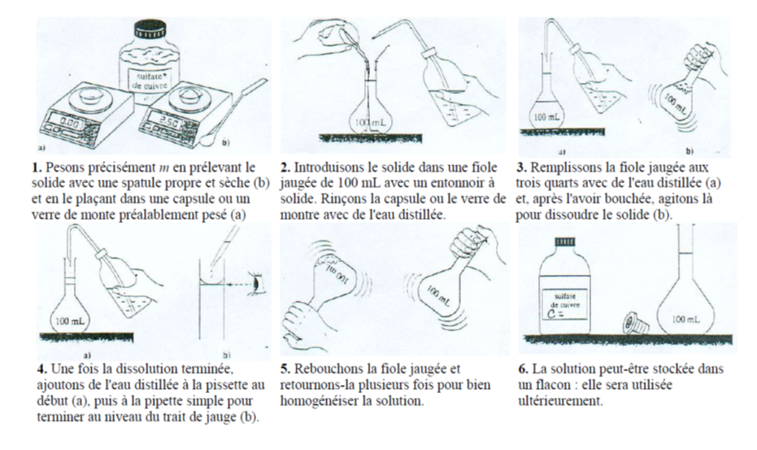

# Concentration d’une solution

Une grande partie des réactifs que l’on utilise en chimie sont des
solutions. On a donc besoin d’établir, non-seulement une grandeur qui
caractérise les solutions et leurs contenus, mais qui contient aussi de
quantité de matière (i.e. nombre de moles). Cette grandeur s’appelle la
concentration d’une solution. On utilise deux types de concentration :
**concentration massique** et **concentration molaire**.

!!!success **Définition : *Concentration massique***  
La concentration massique $C_m$ est le rapport de la masse $m$ du soluté par le volume $V$ de la solution. Elle est donnée par la relation suivante :

$$
  C_m=\dfrac{m}{V} \text{ où }  
            \begin{cases}
            C_n  \quad \text{est la concentration massique} (\; g\cdot L^{-1}) \\
            n  \quad \text{est la masse du soluté }(g) \\
            V \quad \text{est le volume de la solution }(L)
            \end{cases}
$$

La concentration massique s’exprime toujours en gramme par litre
$\; g\cdot L^{-1}$.

!!!

!!!success **Définition : *Concentration molaire***  
La concentration molaire (= molar
concentration) $C_n$ est le rapport de la quantité de matière
$n$ du soluté par le volume $V$ de la solution. Elle est donnée par
la relation suivante :

$$
  C_n=\dfrac{n}{V} \text{ où }  
            \begin{cases}
            C_n  \quad \text{est la concentration molaire} (\; mol\cdot L^{-1}) \\
            n  \quad \text{est la quantité de matière du soluté }(mol) \\
            V \quad \text{est le volume de la solution }(L)
            \end{cases}
$$

La concentration massique s’exprime toujours en moles par litre $\; mol\cdot L^{-1}$.
!!!

!!!warning **Remarque.** *  
On note souvent la concentration d’une espèce chimique avec des crochets $[ \; ]$. La concentration de diiode dans une solution est Donc notée
: 
$[I_2]=\frac{n_{I_2}}{V}$, où la concentration d’une eau sucrée peut être notée : $[C_{12}H_{22}O_{11}]=\frac{n_{C_{12}H_{22}O_{11}}}{V}$

!!!

## Préparer une solution 

==- [!badge Exercice d'application]
+++ Enoncé 
$\triangleright  On dissout $3,0\; g$ de diiode
dans le cyclohexane. On obtient une solution de volume $V=150\; L$.

1.  Déterminer la concentration massique de cette solution.

2.  Déterminer la concentration molaire de cette solution.
+++ Solution
+++
==-
