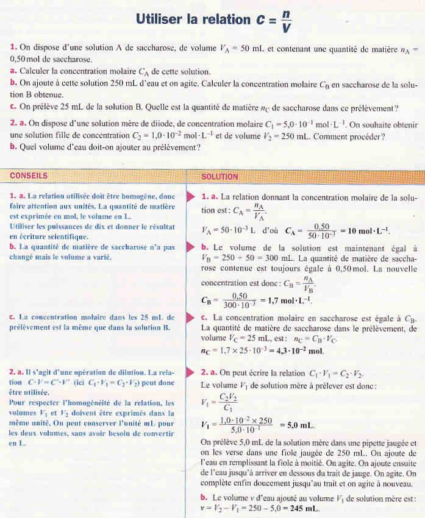
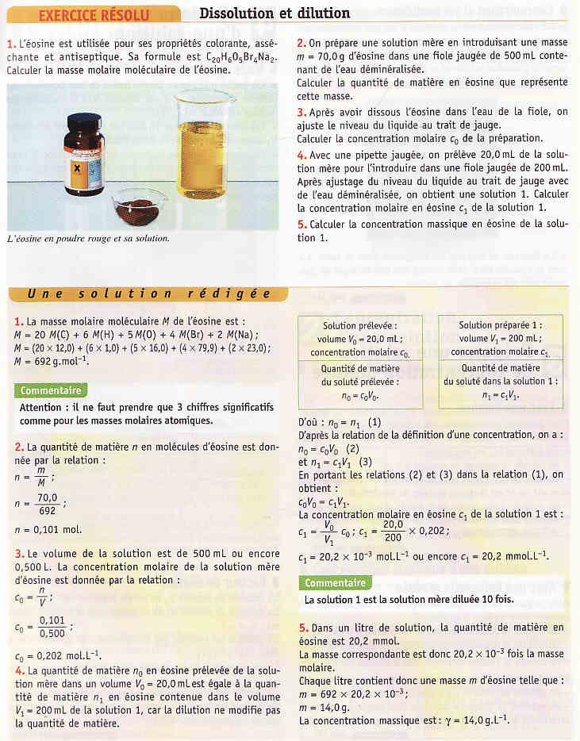
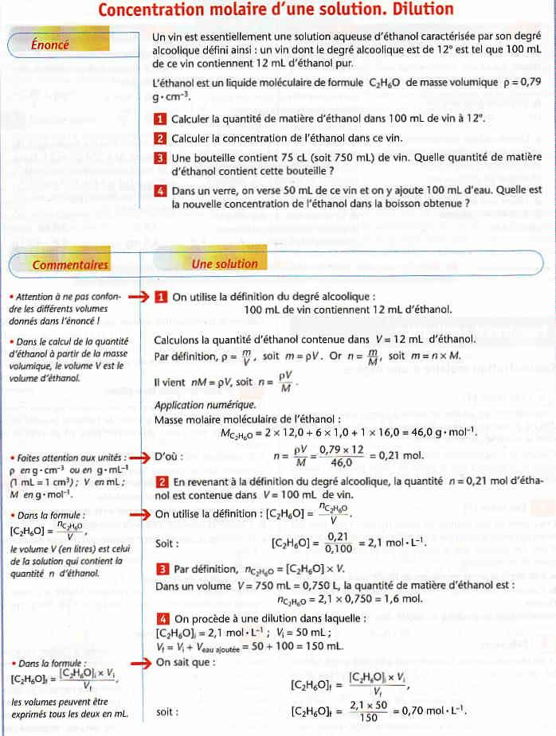

# Dilutions

Assez souvent on a besoin de **changer la concentration** d’une solution afin d’avoir les réactifs dans les bonnes proportions. Afin d’y arriver on a donc besoin d’effectuer une dilution.

!!!success **Définition : *Dilution***

- Diluer une solution, c’est, en **ajoutant du solvant**, constituer une
  nouvelle **solution moins concentrée** que la solution initiale.

- La solution initiale s’appelle la **solution mère**, et la solution
  diluée s’appelle la **solution fille**.

- La solution fille a toujours une concentration inférieure à celle de
  la solution mère.
!!!

Considérons la situation suivante : On dispose d’un volume $V$ d’une solution $A$, de concentration molaire en soluté $C$. Nous allons diluer cette solution en ajoutant du solvant. La solution $A$ est la solution mère. La solution $B$, obtenue après dilution est la solution fille. Elle a une concentration molaire $C'$ et son volume est $V'$.

Lors de la dilution, le volume augmente, mais la quantité de matière de soluté n est toujours la même. On peut donc écrire :

$$
    C=\dfrac{n}{V} \text{  et  } C'=\dfrac{n}{V'} \quad (1)
$$

Or nous avons $V<V'$ et donc $\dfrac{1}{V}>\dfrac{1}{V'} \Longleftrightarrow C>C'$. On voit donc qu’une dilution donne une **diminution de la concentration de la
solution mère**.

Revenons alors à l’équation (1) :

$$
\begin{aligned}
    C=\dfrac{n}{V} &\Longrightarrow n=C\cdot V \\
    C'=\dfrac{n}{V'} &\Longrightarrow n=C'\cdot V'
\end{aligned}
$$

Dans une dilution, la quantité de matière ne change pas. Si l’on appelle $C$ et $V$ la concentration molaire et le volume de la solution mère, et $C'$ et $V'$ la concentration molaire et le volume de la solution fille, on arrive à la relation suivante :
$$
    C\cdot V = C'\cdot V' (2)
$$

## Préparation d’une solution par dilution

Souvent on prépare une solution d’une concentration donnée $C'$ en diluant une solution concentrée d’une concentration connue $C$. Cette opération n’est possible que si $C'<C$.

On commence en écrivant $C\cdot V=C'\cdot V'$.

Connaissant la concentration $C$, la valeur de la concentration désirée $C'$ et celle du volume désiré $V'$, on en déduit la valeur du volume $V$ :

$$
V = \dfrac{C'\cdot V'}{V}
$$

On prélève un volume $V$ de la solution mère. On ajoute alors un volume $v = V' - V$ de solvant (presque toujours de l’eau distillée), de façon à obtenir un $V'$.

Voici la réalisation pratique d’une dilution :

==- [!badge Exercice d'application]
+++ Enoncé 
$\triangleright On dispose d’une solution de
sulfate de cuivre, de concentration $C=1,00\cdot 10^{-2}\; mol\cdot L^{-1}$. On souhaite obtenir un volume $V'=100 \; mL$ d’une solution fille de concentration $C'$ qui est
$\frac{1}{100}$ de la concentration mère.

1.  Quel est le volume de solution mère à prélever ?

2.  Donner le mode opératoire.
+++ Solution
+++
==-

==- [!button Exerices Résolus]

==-