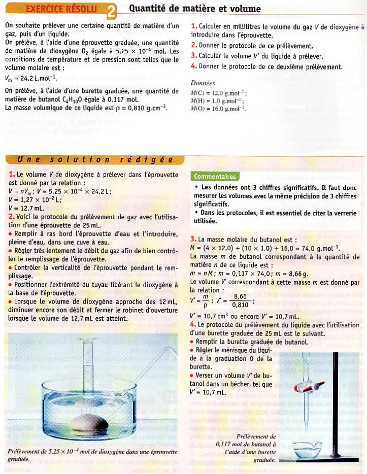

# Fractions massique & volumique

La physique et la chimie sont des sciences expérimentales et dépendent fondamentalement des mesures. C’est pour cette raison-là que nous avons
inventé de manières très diverses de mesures les quantités des choses.
Nous verrons une des méthodes les plus importantes de mesure la quantité
de matière bientôt, mais d’abord nous allons parler de grandeurs
courantes, qui nous aide à déterminer la portion d’une matière qui est
constituée d’une substance.

!!!success **Définition : *Fraction massique***

- La fraction massique $f_m$ est une grandeur qui représente la
  composition d’un mélange (ou d’un alliage) exprimée en fonction de la
  proportion des masses de chaque composant du mélange et la masse
  totale.

- La fraction massique est donnée par la relation suivante :
  $$
  f_m = \dfrac{m_{espèce}}{m_{totale}} \hspace{15pt} \text{où } 
          \begin{cases}
          f \longrightarrow\text{fraction massique \quad (sans unité)} \\
          m_{espèce} \longrightarrow\text{masse du composant de l'échantillon} \quad (\text{$g$ ou $Kg$})\\
          m_{totale} \longrightarrow\text{masse totale de l'échantillon} \quad (\text{$g$ ou $Kg$})
          \end{cases}
!!!

Il est donc entendu que la fraction massique $f_m$ est sans unité et
inférieur ou égal à $1$ (i.e. $f_m \leq 1$). Il est possible
d’obtenir, en multipliant $f_m$ par $100$, une nouvelle grandeur le
**pourcentage massique** noté $m\%$ ou $\% mas$.

!!!light **Exemple:** La **fonte** et l’**acier** sont des **alliages**
((= alloy)) du **fer** et du
**carbone**. Ce qui différencie l’un de l’autre est la fraction massique
de carbone. 
Si le pourcentage massique en carbone est 
* $0,02\% \leq m\% \leq 2\%  \longrightarrow acier$ 
* $2\% \leq m\% \leq 6,7\%  \longrightarrow fonte.$
!!!

Cette différence de teneur en carbone, d’ailleurs, confère aux deux
alliages des propriétés très différentes, avec la fonte, par exemple
étant plus cassante et moins malléable que l’acier.

==- [!badge Exercice d'application]
+++ Enoncé 
$\triangleright  Calculer la masse de chlorure de
sodium et de l’eau nécessaires pour l’obtention de $250\; g$ solution
de chlorure de sodium avec le pourcentage massique $10\%$.
+++ Solution
+++
==-

!!!success **Définition : *Fraction volumique***

- La fraction volumique $f_V$ est une grandeur qui représente la
  composition d’un mélange gazeux exprimée comme la proportion du volume
  de chaque gaz composant le mélange et le volume total du mélange.

- La fraction volumique est donnée par la relation suivante :
  $$
  f_V = \dfrac{V_{espèce}}{V_{totale}} \hspace{15pt} \text{où } 
          \begin{cases}
          f_V \longrightarrow\text{fraction volumique \quad (sans unité)} \\
          V_{espèce} \longrightarrow\text{Volume du composant de l'échantillon} \quad (\text{$L$ ou $m^3$})\\
          V_{totale} \longrightarrow\text{Volume totale de l'échantillon} \quad (\text{$L$ ou $m^3$})
          \end{cases}
  $$
!!!

Comme avec la fraction massique il est entendu que la fraction volumique
$f_V$ est sans unité et inférieur ou égal à $1$ (i.e. $f_V \leq 1$
); et qu’en multipliant $f_V$ par $100$, une nouvelle grandeur le
**pourcentage volumique** noté $V\%$ ou $\% vol$.

==- [!badge Exercice d'application]
+++ Enoncé 
$\triangleright  Les gaz principaux dans
l’atmosphère sont le diazote et le dioxygène , avec des pourcentages
volumiques respectifs de $78\%$ et de $21\%$. Déterminer le volume
de chaque gaz dans un échantillon de $55 \; L$ d’air.
+++ Solution
+++
==-

# La quantité de matière

En chimie, on différencie entre deux échelles fondamentales :

- L’échelle **macroscopique**, c’est-à-dire l’échelle humaine où l’on
  manipule les produits chimiques,

- L’échelle **microscopique**, où se trouvent les constituants de la
  matière qui participent aux réactions, et dont les caractéristiques
  (e.g. masse, volume, etc.) ne sont pas mesurables directement avec des
  instruments d’usage courant.

Nous avons donc besoin de pouvoir mesurer des quantités de matière avec
une unité qui est **adaptée** à l’échelle macroscopique. Cette grandeur
macroscopique s’appelle la **Quantité de matière**
((= amount of substance)), notée
$n$, dont l’unité est *la Mole*.

## La Mole :skull:

*Les chouquettes sont chouettes.*

Si l’on voulait acheter des chouquettes pour une fête, il est plus
pratique de commander le **nombre de douzaines** (ou nombre de paquets)
de chouquettes nécessaires, (au lieu d’un nombre exacte de chouquettes
individuels). La douzaine (ou le paquet) est donc l’**unité
macroscopique** des chouquettes.

En transposant cette analogie aux atomes et molécules (et toute autre
*entité chimiques*), alors, au lieu d’indiquer les millions de milliards
de particules nécessaires pour une réaction chimique, il est plus
pratique d’introduire un « paquet » de particules, c’est-à-dire une
unité bien adaptée à l’échelle macroscopique.

!!!success **Définition : La Mole**

- **La mole** est l’unité de **Quantité de Matière**.

- On utilise la mole pour indiquer le nombre d’atomes, de molécules, ou
  d’ions dans un échantillon de matière (en gros, le nombre total de
  particules microscopiques dans l’échantillon). Par exemple, on peut
  dire : *$3$ moles de cuivre*, ou *$0,75$ moles de* , ou
  *$10^{-7}$ moles de*

- La mole notée $n$, et le symbole de cette unité est $mol$ (i.e.
  \[n\]=mol.)

- Une mole est la quantité de matière d’un système contenant autant
  d’entités élémentaires qu’il y a dans $12 \; g$ de *Carbone-12*. Ce
  nombre est donné par la **Constante d’Avogadro**
  $N_\mathcal{A}=6,023\cdot 10^{23}$ .

- Le nombre d’entités élémentaires $N$ dans un échantillon de $n$
  moles est donné par la formule :
  $$
  N = n\cdot N_\mathcal{A}\quad \text{où } \quad
          \begin{cases}
          N \longrightarrow\text{nombre d'entité dans l'échantillons \quad (sans unité)} \\
          n \longrightarrow\text{quantité de matière} \quad (mol)\\
          N_\mathcal{A} \longrightarrow\text{constante d'Avogardo} \quad (mol^{-1})
          \end{cases}
  $$
!!!

Quelle est donc la morale de cette histoire?

Une douzaine est un paquet de douze, tandis qu’**une mole est un paquet de $N_\mathcal{A}=6,023\cdot 10^{23}$.**

!!!light **Exemple:**

- $1 \; mole$ de Fer contient $6,023\cdot 10^{23}$ *atomes* de fer

- $1 \; mole$ d’eau contient $6,023\cdot 10^{23}$ *molécules* d’eau.

- $3,3 \; mole$ de (ion de sodium), contient :
  $N=n\cdot N_\mathcal{A}=(3,3)(6,023\cdot 10^{23}) = 2,0\cdot 10^{24} \quad \text{ions de sodium}$
!!!

==- [!badge Exercice d'application]
+++ Enoncé 
$\triangleright$ Combien de moles constituent
$10^{20}$ molécules de $HC\ell$? Donner la réponse en $mol$
ainsi qu’en $mmol$.
+++ Solution
+++
==-

# Les quantités molaires

Lors de notre préparation pour la grande fête (le 4 janvier,
l’anniversaire de Newton, évidemment), on achète nos chouquettes chez les deux grands pâtissiers du quartier : Louis Lorge, et Léo Lafarine. On constate que les chouquettes de Lafarine n’ont ni la même masse ni la
même taille de celles de Lorge (quel scandale) ! Donc une douzaine de chouquettes de Lafarine n’aura pas non plus la même masse que la douzaine de Lorge (ni la même taille).

La situation est identique pour les entités élémentaires : les différentes particules ont des masses différentes, et par conséquent, la masse d’une mole d’un atome diffère de la masse d’une mole d’un autre type d’atome. Ceci nécessite l’introduction des grandeurs dites molaire.

## Masse molaire

!!!success **Définition : *masse molaire***  
La masse molaire d’une espèce chimique est la **masse d’une mole** d’entités de cette espèce.  
Elle est notée $M$, et elle s’exprime en $\; g\cdot mol^{-1}$
(gramme par mole).
!!!

A partir de cette notion on peut définir deux types de masses molaires :

- Masse molaire atomique

- Masse molaire moléculaire

!!!success **Définition : *Masse molaire atomique***  
La masse d’une mole d’atome à l’état naturel, c’est-à-dire compte tenu
de tous ses isotopes, et de leur abondance relative.  
Il existe une relation entre la quantité de matière n et la masse
molaire $M$ :
$$
n = \dfrac{m}{M}  \quad \text{où } \quad
        \begin{cases}
        m \longrightarrow\text{la masse de l'échantillon \quad (g)} \\
        n \longrightarrow\text{quantité de matière} \quad (mol)\\
        M \longrightarrow\text{masse molaire} \quad (\; g\cdot mol^{-1})
        \end{cases} 
$$
!!!

Les masses atomiques de la classification des éléments sont en fait leur
masse molaire. Donc la masse molaire d’hydrogène est $1$ gramme par
mole : c’est-à-dire, une mole d’hydrogène $6,023\cdot 10^{23}$ atomes
d’hydrogène) a une masse de $1$ gramme.

==- [!badge Exercice d'application]
+++ Enoncé 
$\triangleright  Dans l’état naturel, un
échantillon de chlore contient les deux isotopes principaux de chlore
dans les proportions suivantes : $76\%$ de et $24\%$ de .  
*Données* : $\begin{cases}$ m( ) = 5,807^-23 g$\\
$ m( ) = 6,138^-23 g$\end{cases}$
+++ Solution
+++
==-

!!!success **Définition : *Masse molaire moléculaire***  
La masse d’une mole d’une molécule. Elle s’établit en effectuant la
somme des masses molaires atomiques de chacun des atomes qui constituent
la molécule.
!!!

==- [!badge Exercice d'application]
+++ Enoncé 
$\triangleright$  Calculer la masse molaire de .
+++ Solution
+++
==-

## Volume molaire

Pour les solides et les liquides, une même quantité de matière d’espèces
chimiques différentes ne présente ni le même volume ni la même masse.

Le cas des gaz est différent. Le comportement de matière dans l’état
gazeux est donné par la **loi d’Avogadro-Ampère** .

!!!success **Définition : *Volume molaire***

- A température et pression données, le volume occupé par une mole de
  gaz est **indépendant de la nature du gaz**.

- Ce volume est appelé **volume molaire**((=
  molar volume)). On le note $V_m$ , et il s’exprime en
  $L\cdot mol^{-1}$.

- la quantité de matière d’un gaz est donnée par la relation suivante :
  $$
  n = \dfrac{V}{V_M} \quad \text{où } \hspace{10pt}
          \begin{cases}
          V \longrightarrow\text{la Volume du gaz parfait \quad (L)} \\
          n \longrightarrow\text{quantité de matière} \quad (mol)\\
          V_M \longrightarrow\text{Volume molaire} \quad (L\cdot mol^{-1})
          \end{cases}
  $$
!!!

Un gaz à une température ambiante ($20\degree$) à la pression
atmosphériques ($1013\; hPa$) a un volume molaire de
$V_M=24,0 L\cdot mol^{-1}$.

Le volume molaire d’un gaz dépend de la température et de la pression du gaz considéré. L’évolution du volume molaire en fonction de la température :

| Température (°C) | Volume molaire ($L\cdot mol^{-1})$ |
|:----------------:|:------------------------------------:|
|        0         |                 22,4                 |
|        20        |                  24                  |
|       100        |                 30,6                 |
|       500        |                 63,4                 |
|       1000       |                104,0                 |

==- [!badge Exercice d'application]
+++ Enoncé 
$\triangleright 

1.  Calculer la quantité de matière contenue dans un volume
    $V=1,00 \; L$ de vapeur d’eau à $20 \degree C$ à la pression
    atmosphérique.

2.  Calculer la quantité de matière contenu dans un volume
    $V=1,00\; L$ de vapeur d’eau à $500 \degree C$ à la pression
    atmosphérique.

3.  Calculer le volume de $n=3,58\; mol$ de vapeur d’eauà
    $20\degree C$ à la pression atmosphérique, en $L$ et en $mL$.
+++ Solution
+++
==-

==- [!button Exercices Résolue]

==-