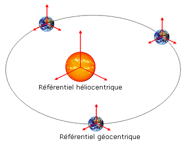

# Référentiels

!!!success **Définition : *Référentiel***  
Un référentiel est constitué de :

- un objet (ou point fixe) par rapport auquel on étudie le mouvement
  d’autres objets.

- une horloge permettant un repérage des dates.
!!!

Je vous entends déjà demander *Mais ... Pourquoi a-t-on besoin d’une
horloge?”*

C’est simple, car pour que la description d’un mouvement (ou plus précisément d’un ‘événement’) soit précise, il faut indiquer la position du point considéré dans l’espace, mais *aussi* dans le temps !

Le choix d’un référentiel est arbitraire. C’est à nous de choisir le
point de référence. Par conséquent, le mouvement du système étudié
dépendra de ce choix.

Naturellement il y une infinité de référentiel possible, mais en pratique il y en a quelques un qui sont plus utilisé et plus importants :

- Les **référentiels Terrestres** sont construits à partir de n’importe
  quel **point de référence lié à la Terre**, c’est-à-dire un point fixe
  par rapport à la Terre. Ce sont les référentiels les plus naturels
  pour les êtres humains, et pour étudier des mouvements sur la Terre.

- Le **Référentiel Géocentrique** est souvent utilisé afin de décrire
  les mouvements des satellites de la Terre (e.g. la lune). Dans ce
  référentiel on peut imaginer une boîte que l’on découpe pour n’en
  garder qu’un coin. Supposons que le sommet du coin coïncide avec le
  centre de la Terre, et une de ses arêtes avec l’axe des pôles
  terrestre. Les deux autres arêtes du coin sont dirigées vers des
  étoiles fixes (les étoiles qui ne se déplacent pas dans le ciel). Ce
  coin représente le point de référence attaché au référentiel
  géocentrique. N.B. La Terre n’est pas immobile dans ce référentiel,
  car elle tourne autour d’une des arêtes du coin.

- Le **Référentiel Héliocentrique**, comme le référentiel géocentrique
  sauf que maintenant que le commet du coin coïncide cette fois avec le
  centre du Soleil. Une des arêtes est perpendiculaire au plan des
  orbites planétaires. Les deux autres sont dirigées vers les étoiles
  fixes. Ce coin représente le point de référence.
