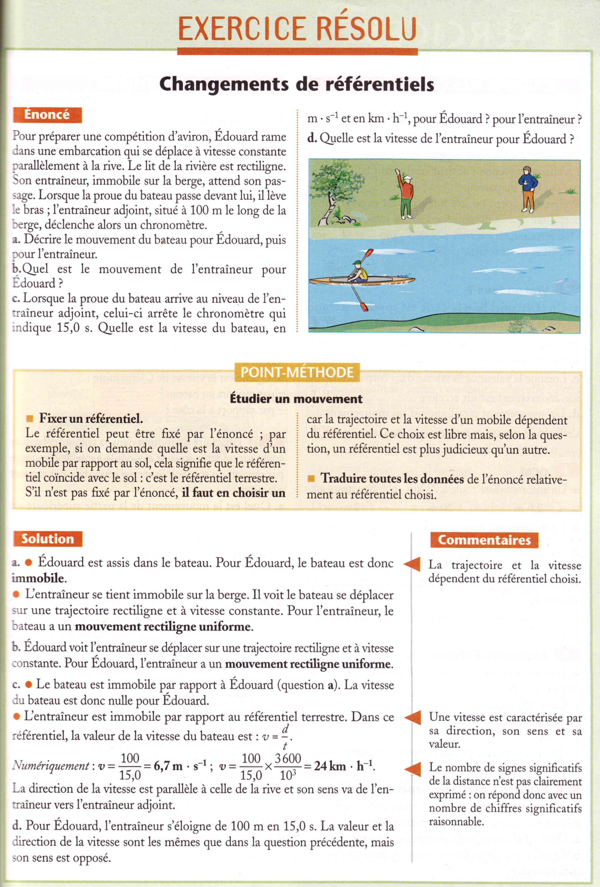
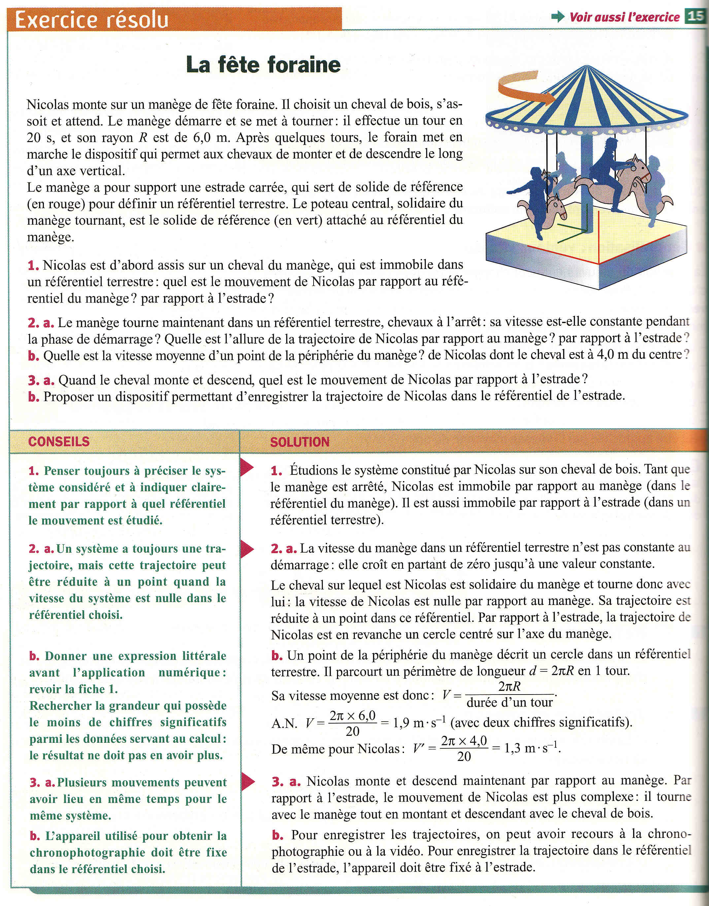
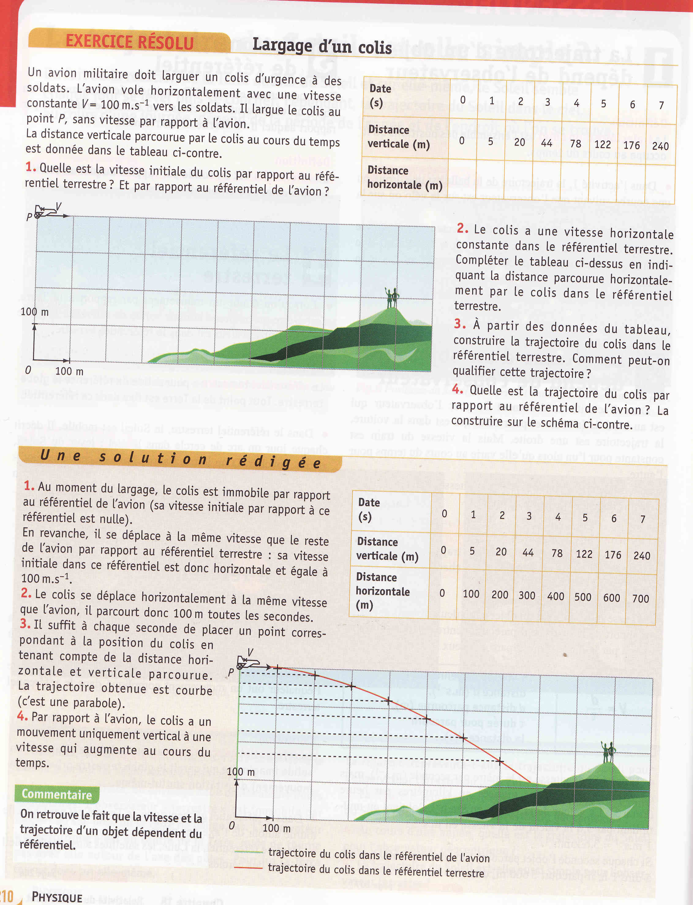

# Vitesse

On a appris – j’espère – que la **vitesse moyenne**
(= average speed) d’un mobile est donnée par l’équation :

$$
v=\dfrac{d}{t} \text{ \quad   où \quad }
\begin{cases}
v \text{ est \textbf{valeur} de la vitesse moyenne, en }\; m\cdot s^{-1}&\\
d \text{ est la \textbf{distance} parcourue, en }m &\\
v \text{ est durée du parcours }(t_{arrivé} - t_{départ}) \text{ en } s
\end{cases}
$$

Cette équation nous donne la valeur de la vitesse moyenne parcourant la distance $d$ pendant l’intervalle $t$.

On a déjà établi, dans la partie précédente, que la distance parcourue (qui dépend de la trajectoire) dépend du référentiel, c’est donc clair que la **vitesse d’une point *aussi* dépend du  référentiel**. Quand la vitesse d’un mobile est constante, le mouvement est appelé **uniforme**. Donc, par exemple, on objet qui trace un cercle avec une vitesse constante a un mouvement **circulaire uniforme**.

Mais la vitesse d’un mobile n’est pas caractérisée par sa valeur (= magnitude), mais aussi par sa direction : il s’agit d’une grandeur dite **vectorielle**  (i.e. une grandeur qui as une valeur ainsi que qu’une direction). Dans le cas de la vitesse, cette grandeur s’appelle le *vecteur*-vitesse.

On peut étudier l’évolution de la vitesse d’un mobile, en comparant les distances $d$ consécutives parcourues pendant la même durée $t$ :

- Les distances $d$ restent **constantes** $\to$ vitesse **constante** $\Rightarrow$ mouvement **uniforme**

- Les distances $d$ **augmentent** $\to$ la vitesse **augmente** $\Rightarrow$ mouvement **accéléré**

- Les distances $d$ **diminuent** $\to$ la vitesse **diminue** $\Rightarrow$ mouvement **ralenti/retardé**

==-
[!button Exercices Résolus]

==-