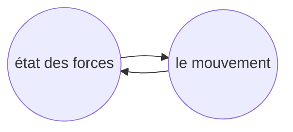
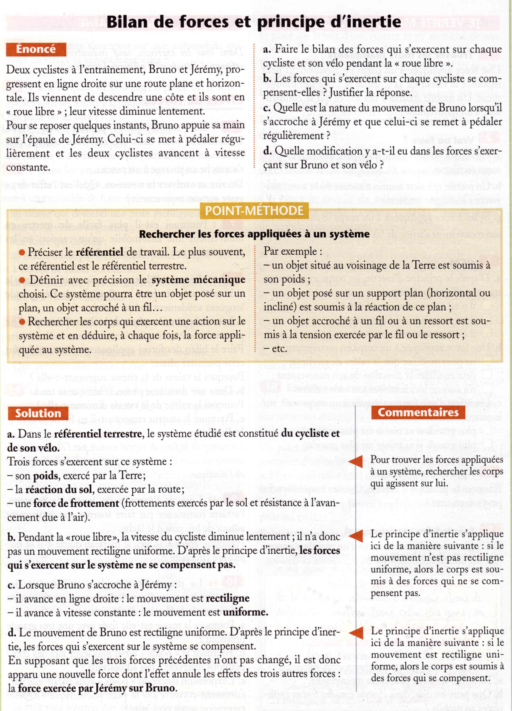
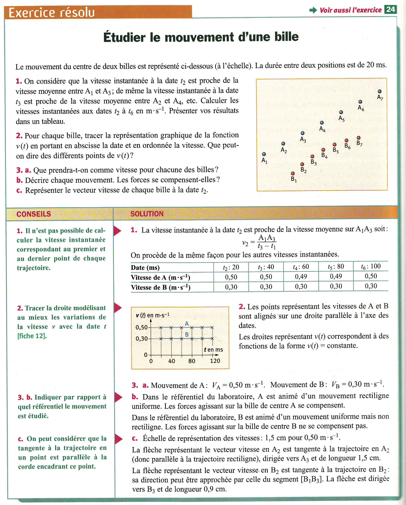
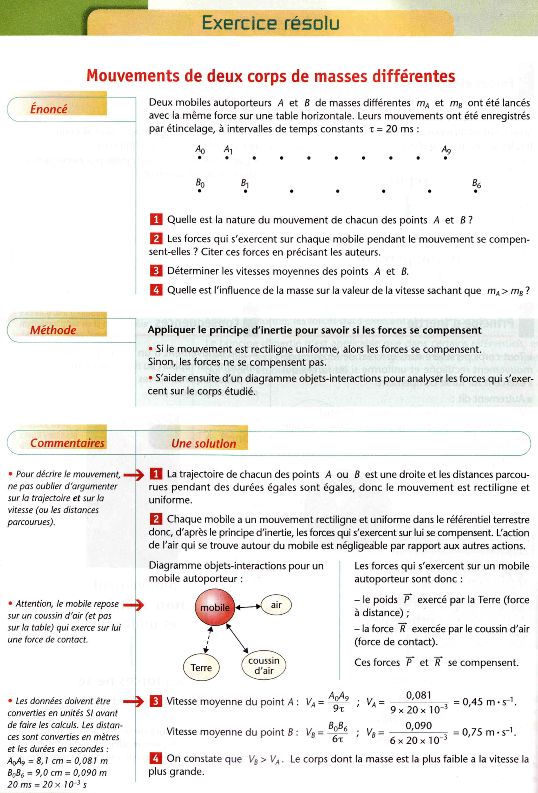
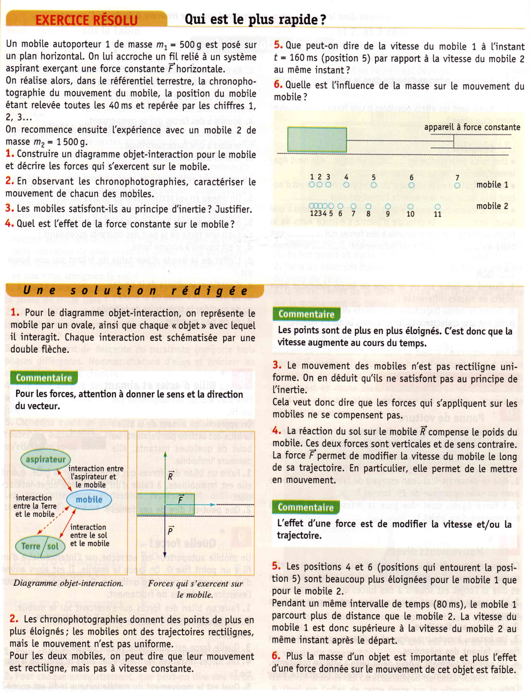

# Principe d’inertie

!!!success **Définition : *Principe d’inertie***

- Un système persévère dans son **état de
  repos** ou de mouvement rectiligne uniforme **si les forces qui s’exercent sur lui se compensent.**

- Réciproquement, si un système persévère dans son état de repos ou de mouvement rectiligne uniforme, cela signifie que les forces agissant sur le système s’annulent.

- Encore, autrement énoncé : un corps soumis à des forces qui se compensent est l’équivalent d’un corps qui n’est soumis à aucunes forces.
!!!

On peut donc caractériser l’inertie comme la propriété de conserver une (vecteur) vitesse constante.

Ce qui fait la puissance de ce principe simple est le fait qu’il établit une relations claire et facile à exploiter et appliquer entre l’état des forces sur un objet et l’état de son mouvement : **si nous avons de
l’information sur l’un nous pouvons en faire une conclusion sur l’autre.**

!!!info **En  résumé :** 

$$
\text{Les forces se compensent} \Leftrightarrow
    \begin{cases}
      \text{état de repose} \\
      \text{mouvement rectiligne et uniforme} \\
    \end{cases}
$$

$$
\text{Les forces ne se compensent pas} \Leftrightarrow 
    \begin{cases}
      \text{mouvement rectiligne et non-uniforme} \\
      \text{mouvement non-rectiligne et uniform} \\
      \text{mouvement non-rectiligne et non-uniforme} 
    \end{cases}
$$
!!!

Considérons alors les situations suivantes, et essayons de les expliquer grâce au principe d’inertie :

+++ Situation 1
Une personne assise dans une voiture immobile sentira une force vers l’arrière quand la voiture commence à bouger vers l’avant.
+++ Explication
La personne est dans l’état de repos dans le référentiel terrestre, qui comprend la voiture immobile. Selon le Principe d’inertie, son corps veut rester dans cet état. Quand la voiture commence à se déplacer, le corps voudrait rester immobile dans le référentiel Terrestre, mais dans le référentiel de la voiture il est maintenant en mouvement vers l’arrière, d’où la « force » qu’il sent dans cette direction.
+++ 

+++ Situation 2
 Une personne dans une voiture en mouvement rectiligne uniforme (vitesse constante, ligne droite) sentira une force vers la gauche quand la voiture fait un virage vers la droite.
 +++ Explication 
 La personne et la voiture sont dans un mouvement rectiligne uniforme, et ils veulent rester dans cet état. Quand la voiture tourne vers la droite, le corps va persister dans son mouvement rectiligne. Donc dans le référentiel de la voiture, on sent une force vers la gauche.
+++

+++ Situation 3
Quand le métro accélère on est « poussé » vers l’arrière.
+++ Explication 
Quand on est stationnaire dans un train immobile on est tous dans l’état de repos. Quand le train commence à se déplacer il est plus dans un état de repos, mais nous on veut rester dans cet état. Donc on va rester immobile dans le référentiel terrestre, et donc on recule dans le train.
+++

+++ Situation 4
Une balle lancée dans l’air subit une seule force, celle de la gravité, qui agit vers le bas, continue à monter malgré l’absence d’une force dans cette direction
+++ Explication
+++

+++ Situation 5 
Quand une bille est posée sur une table, son poids tend à la faire tomber, alors que l’action de la table l’en empêche. Soumise à ces deux forces, la bille reste au niveau de la table. Les forces qui s’exercent sur l’objet se compensent.
+++ Explication
+++

==- [!Button "Exercices Résolus"]

==-