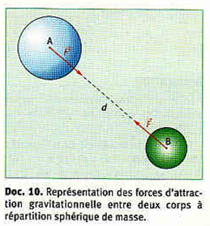
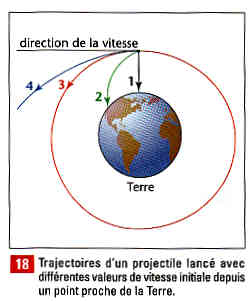
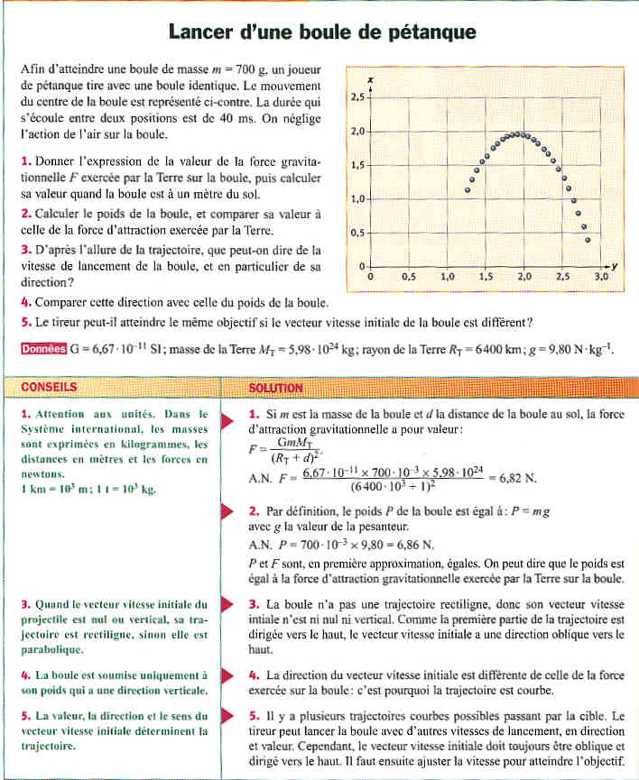
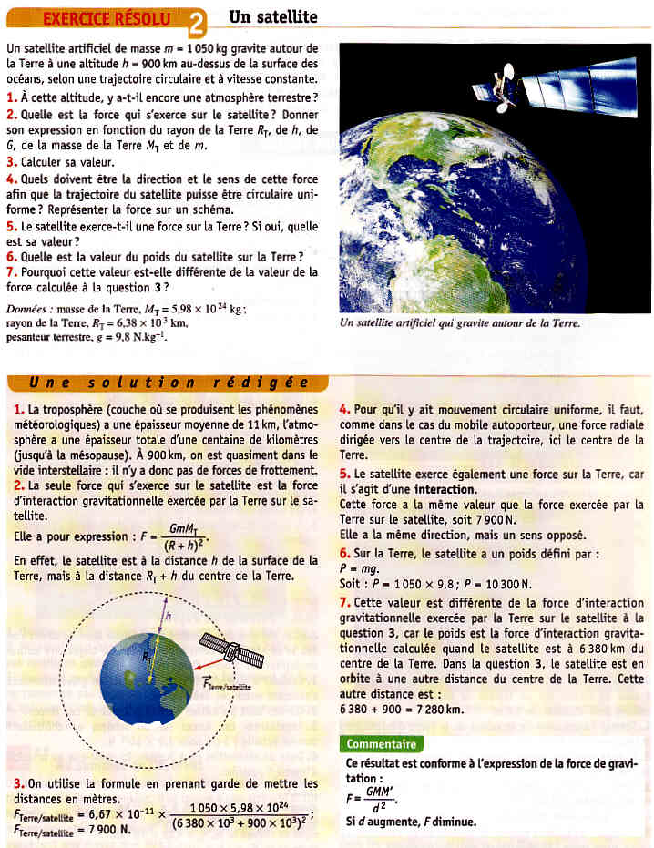

# La gravitation

Une étude simple d’un corps en **chute libre** (= free fall), nous montre que sa trajectoire n’est pas toujours rectiligne et surtout que son mouvement n’est pas uniforme. On en déduit, d’après le principe d’inertie que le corps n’est pas soumise à des forces qui se compensent. En effet, en négligeant le frottement et la résistance de l’air, **la seule force** agissant sur l’objet est celle de **la pesanteur**.

En effet, c’est Newton qui a affirmé que **tout corps ayant une masse sont toujours soumis à une interaction attractive due à leurs masses** : c’est la gravitation universelle.

La force exercée par $A$ sur $B$ est $\vec{F}_{A/B}$ et celle de $B$ sur $A$ est $\vec{F}_{B/A}$.

!!!success **Définition : *Loi de gravitation universelle de Newton***  
Soient deux corps de petites tailles, assimilables à des points $A$ et $B$, et de masses $m_A$ et $m_B$. Une distance de $d$ les sépare.

- La force exercée par $A$ sur $B$ est $\vec{F}_{A/B}$ et celle de $B$ sur $A$ est $\vec{F}_{B/A}$.

- les deux forces ont la même valeur (intensité), mais sont dirigées dans de sens opposé.

- La valeur de cette force est donnée par l’équation suivante :
  $$
  F_{A/B} = {F}_{B/A} = G\cdot\dfrac{m_A\cdot m_B}{d^2}
  \text{\quad où \quad}
      \begin{cases}
      F \text{ est exprimé en newtons, } N \\
      m_A \text{ et } m_B \text{sont en kilogrammes, } kg \\
      G \text{ est la constante universelle de gravitation en }  \\   
      \text{     } m^3\cdot kg^{-1} \cdot s^{-2}
      \end{cases}
  $$
!!!

$G$ est appelé la **constante universelle de gravitation** et a une valeur de $G=6,67\cdot 10^{-11}\quad m^3\cdot kg^{-1} \cdot s^{-2}$.

Les facteurs donc influençant la valeur de la force gravitationnelle sont :

- **la masse** : la force gravitationnelle est proportionnelle à la masse de chacun des corps.

- **la distance** : la force gravitationnelle est inversement proportionnelle au carré de la distance qui sépare les deux corps.

+++ Enoncé
$\triangleright \quad$ Calculer la valeur $F$ des forces gravitationnelle entre deux masses sphériques d’une même masse
$m=50$ kg à une distance de $d=5,0$ m.
+++ solution
+++

+++ Enoné
$\triangleright \quad$**Exercice .** Même question qu’avant en considérant cette fois deux masse sphériques de
$M_{Terre}=6,0\cdot 10^{24}$ kg et $M_{soleil}=2,0\cdot 10^{30}$ kg séparées d’une distance $d=150 \text{  millions de km}$. Commenter les résultats.
+++ solution 
+++

!!!warning **Remarque.**
- Tant qu’un objet a une masse il exerce une force attractive sur les autres masses, et en revanche, tant qu’un objet a une masse, ilsentira la force gravitationnelle d’un autre corps.

- La distance d n’étant définie qu’entre deux points, l’application de la loi nécessite des objets ponctuels. Les objets à répartition sphérique se comportent comme des objets dont la masse est placée au centre. Pour beaucoup d’autres objets, si la distance d est très grande devant.
!!!

+++ Enoncé
$\triangleright \quad$**Exercice .** **Gravitation d’une Planète**

Un corps à répartition sphérique de masse est un corps sphérique dont la matière est répartie uniformément (ou en couche sphérique) autour de son centre. En première approximation, le Soleil, la Terre et les autres 
étoiles et planètes peuvent être considérer comme des corps à répartition sphérique. Donc du point de vu de l’attraction gravitationnelle ils sont équivalents à un objet ponctuel, situé à $O$ (le centre de la sphère). Calculer l’expression de la force gravitationnelle exercée par la Terre sur un objet situé à une altitude de $\textbf{z}$.
+++ solution
+++

## Le poids

!!!success **Définition : *Poids***

- Le poids (= weight) d’un objet est la force d’attraction gravitationnelle exercée sur lui par la Terre sur, dans le voisinage immediat de cette dernière.

- Le poids est caractérisé par son/sa:

  - **Direction** : elle est vers le centre de la Terre donc en un point de la surface de la terre la direction est **verticale**.

  - **Sens** : La force est attractive donc elle est dirigée **vers le centre de la Terre**, donc *localement* le sens est vers le bas.

  - **Point d’application** : La force s’applique au **centre de gravité** d’un corps.
!!!

### Expression littérale du poids

Considérons un corps quelconque a avec une masse de $m_A$ au voisinage de la surface de la Terre avec une masse de $m_T$. Appliquons la loi de Gravitation Universelle :
$$
F_{T/A} = F_{A/T} =  F = G\cdot \dfrac{m_A\cdot m_T}{d^2}
$$

A la surface de la Terre la distance $d$ (entre l’objet à la surface et le centre de la Terre) est égale au rayon de la Terre $R_t$. L’équation de la force gravitationnelle devient donc :

$$
F = G\cdot \dfrac{m_A\cdot m_T}{R_T^2}
$$

On sait que $G$ est une constante. Mais la masse de la Terre est constante aussi, ainsi que le Rayon Terrestre. On peut donc réécrire l’expression de $F$ ainsi :

$$
F = \left(G\cdot \dfrac{m_T}{R_T^2}\right)\cdot m_A
$$

L’expression $(G\cdot \dfrac{m_T}{R_T^2})$ est une constante, donc on peut la renommer $g$. On arrive ainsi à l’expression suivante (que vous devez reconnaitre) :
$$
poids = F_g = P = m\cdot g \quad où \quad g=G\cdot \dfrac{m_T}{R_T^2}=9,8 \; N\cdot kg^{-1}
$$

La constante $g$ s’appelle "l’**intensité de la pesanteur**", et est une constante qui caractérise l’intensité du **champ gravitationnel au voisinage de la Terre**. On voit donc qu’à la surface de la Terre le champ de la gravité Terrestre est plus ou moins constant.

On voit aussi que l’**intensité de la pesanteur dépend de l’altitude** (car la distance par rapport au centre de la Terre serait le rayon de la Terre PLUS l’altitude par rapport à la surface de la Terre).

En fait, la Terre n’étant pas exactement sphérique, le poids d’un objet dépend aussi de sa position sur la Terre. Notre planète est légèrement aplatie aux pôles, par conséquent le poids d’un objet est plus fort aux pôles ($R_T$ étant plus petit), et plus faible à l’équateur ($R_t$ étant plus grand).

+++ Enoncé 
$\triangleright \quad$ **Exercice .** **Pesanteur sur la Terre**

Calculer la valeur $g_z$ de l’intensité de la pesanteur sur la Terre à une altitude de $z$. Faites l’application numérique au sommet d’Everest ($8,8$ km).
+++ Solution 
+++ 

+++ Enoncé
$\triangleright \quad$**Exercice .** **Pesanteur sur la Lune**

Calculer la valeur $g_L$ de l’intensité de la pesanteur sur la Lune en
sachant que le rayon de la Lune est de $R_L=1740 km$ , et la masse
lunaire $m_L= 7,35\cdot 10^{22}$ kg. Puis, calculer le poids d’un
objet de masse $m=80$ kg à la surface de la Lune.
+++ solution
+++

## Trajectoire d’un objet en chute libre

!!!success **Définition : *Chute libre***
 
- On dit qu’un objet est en **chute libre** s’il n’est **soumis qu’à la force gravitationnelle**, (ou si les forces exercées par l’air sur le corps en mouvement sont négligeable devant son poids).

- Un **projectile** est un objet lancé dans l’air au voisinage de la Terre
!!!

Les forces agissant sur un projectile en chute libre ne se compensent pas : au voisinage de la Terre, le projectile en chute libre n’est en effet soumis qu’à son poids. Par conséquent, le principe d’inertie permet de conclure que, le mouvement du centre du projectile **n’est pas rectiligne uniforme**.

Donc, dans un référentiel donné, le mouvement d’un projectile dépend de la 1) valeur de vitesse initiale, et 2) direction de lancement ; autrement dit, le mouvement d’un projectile dépend du vecteur-vitesse initiale du mouvement.

- Si la vecteur-vitesse initiale est nul ou vertical, alors, sa trajectoire est rectiligne verticale et le mouvement n’est pas uniforme.

- Si le vecteur-vitesse initiale n’est ni nul ni verticale, alors sa trajectoire est **parabolique**. Sa vitesse verticale varie mais la vitesse horizontale reste constante.

### Décomposition du mouvement

Comme on a vu dans le TP Vélo-boule, le mouvement d’un objet est décomposable, c’est-à-dire, on peut montrer que le mouvement 2-dimensionnel (ou 3-D) d’un corps est la somme de deux (ou trois) mouvement plus simple ; la décomposition naturelle est selon les directions horizontale et verticale. De plus, on peut appliquer alors le principe d’inertie séparément à chaque mouvement.

En appliquant cette décomposition à un projectile, on peut étudier son mouvement horizontal et vertical lors d’une chute libre.

- Suivant l’horizontale, les distances entre deux positions successives restent constantes pendant des durées égales $\Rightarrow$ le mouvement est uniforme

- Suivant la verticale, les distances entre deux positions successives varient pendant des durées égales $\Rightarrow$ le mouvement est accéléré (je considère ici que les mouvements ralentis sont accéléré aussi, sauf avec une accélération négative).

On peut expliquer ce comportement grâce au principe d’inertie. Un objet en chute libre n’est soumis qu’à son poids, donc :

- Horizontalement la somme des forces agissant sur lui est nulle, donc il reste dans son état de mouvement rectiligne uniforme (un objet avec une vitesse horizontale non-nulle) ou état de repos (un objet en chute verticale).

- Verticalement la seule force présente est son poids, donc vu que la somme des forces n’est pas nulle, il n’aura pas un mouvement uniforme, d’où l’accélération vers le sol.

### Satellisation

On lance un projectile depuis un point proche de la Terre avec une vitesse de direction parallèle à la surface terrestre. On peut envisager 4 possibilités dans le référentiel géocentrique :

1.  Pour une vitesse initiale nulle, le projectile tombe selon la verticale (courbe 1)

2.  Pour de faibles valeurs de la vitesse initiale, le projectile retombe sur la Terre ; plus loin avec plus de vitesse initiale. (courbe 2)

3.  Pour une vitesse suffisamment grande, le projectile se met en orbit autour de la Terre : il devient un satellite artificiel de la Terre (un corps en chute libre permanente !) La vitesse du satellite reste alors constante.

4.  Pour les valeurs de vitesse supérieur à celle de 3) $11,2 \; km\cdot h^{-1}$ : vitesse de libération de la Terre le projectile échappe à l’attraction terrestre et quitte le voisinage de la Terre. Touts objets désirant aller dans l’espace ont besoin de franchir cette vitesse d’échappement.

==- [!Button Exercices Résolus]

==-
