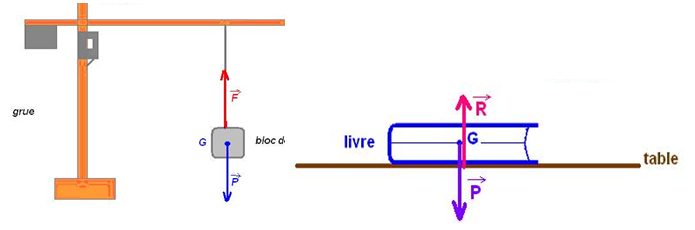

# Forces

**Définition : *Force***

- Une force est une **action mécanique** capable de **modifier et
  changer le mouvement** d’un objet (ou une partie de l’objet).

- Il existe deux types de forces :

  - **Forces de contact** : les actions qui s’exercent tant que le
    contact physique existe. Ex : frottement.

  - **Forces à distance** : les actions qui s’exercent sans qu’un
    contact physique soit nécessaire. Ex : gravitation, électrique,
    magnétique.

## Effets d’une force

Nous avons vu que le mouvement d’un corps est décrit par l’ensemble de
sa **trajectoire**, et de sa **vitesse**. Une force peut donc modifier :

- Uniquement la trajectoire,

- Uniquement la vitesse,

- la vitesse *et* la trajectoire.

**Exemple:** Imaginons une balle de tennis et une balle de bowling. Si
on applique la même force, on verra que le mouvement de la balle de
tennis sera plus modifié que la balle de bowling.

## Vecteur force : Caractéristiques et représentations

Une force est une grandeur physique dite vectorielle, c’est-à-dire, une
grandeur qui a une valeur ainsi que une direction et un sens. Elle est
représentée par un segment fléché, appelé **vecteur force**
(= force vector) :

- L’origine de la flèche est le point d’application. Pour les forces de
  contact c’est le point de contact, et pour les forces à distance c’est
  le **centre de gravité**.

- La direction et le sens de la flèche correspondent à la direction et
  au sens de la force agissant sur le corps.

- La longueur est proportionnelle à la valeur de la force.

- La valeur du vecteur force s’exprime en **newtons**, de symbole $`N`$.

On représente les forces agissantes sur un objet avec un **diagramme de
forces** – aussi appelé un **diagramme du corps libre**
(= Free Body Diagram FBD) – qui
montre le **bilan des forces**.

<figure>

<figcaption>Deux exemples de diagramme de bilan des forces.</figcaption>
</figure>

**QUESTION** : *Je lance une balle de Tennis dans l’air. Après lâcher la
balle, subit-elle une force ?*

**REPONSE** : *Non. Car la force de lancer est une force de contact :
mes muscles génèrent cette force, qui est transmise à la balle grâce au
contact entre ma main et la balle. Quand je lâche la balle, il n’y a
plus contacte entre ma main et la balle, et par conséquent plus de force
appliquée à la balle par la main. Donc cette balle ne subit plus une
force de contact.*

# Principe d’inertie

**Définition : *Principe d’inertie***

- Un système persévère dans son **état de
  repos**(= state of rest) ou de
  mouvement rectiligne uniforme **si les forces qui s’exercent sur lui
  se compensent.**

- Réciproquement, si un système persévère dans son état de repos ou de
  mouvement rectiligne uniforme, cela signifie que les forces agissant
  sur le système s’annulent.

- Encore, autrement énoncé : un corps soumis à des forces qui se
  compensent est l’équivalent d’un corps qui n’est soumis à aucunes
  forces.

On peut donc caractériser l’inertie comme la propriété de conserver une
(vecteur) vitesse constante.

Ce qui fait la puissance de ce principe simple est le fait qu’il établit
une relations claire et facile à exploiter et appliquer entre l’état des
forces sur un objet et l’état de son mouvement : **si nous avons de
l’information sur l’un nous pouvons en faire une conclusion sur
l’autre.**

En résumé

Les forces se compensent $`\longleftrightarrow  \begin{cases}
\text{état de repose} \\
\text{mouvement rectiligne et uniforme} \\
\end{cases}`$

Les forces ne se compensent pas $`\longleftrightarrow \begin{cases}
\text{mouvement rectiligne et non-uniforme} \\
\text{mouvement non-rectiligne et uniform} \\
\text{mouvement non-rectiligne et non-uniforme} 
\end{cases}`$

Considérons alors les situations suivantes, et essayons de les expliquer
grâce au principe d’inertie :

1.  Une personne assise dans une voiture immobile sentira une force vers
    l’arrière quand la voiture commence à bouger vers l’avant.

2.  Une personne dans une voiture en mouvement rectiligne uniforme
    (vitesse constante, ligne droite) sentira une force vers la gauche
    quand la voiture fait un virage vers la droite.

3.  Quand le métro accélère on est « poussé » vers l’arrière.

4.  Une balle lancée dans l’air subit une seule force, celle de la
    gravité, qui agit vers le bas, continue à monter malgré l’absence
    d’une force dans cette direction

5.  Quand une bille est posée sur une table, son poids tend à la faire
    tomber, alors que l’action de la table l’en empêche. Soumise à ces
    deux forces, la bille reste au niveau de la table. Les forces qui
    s’exercent sur l’objet se compensent.

Explications :

1.  La personne est dans l’état de repos dans le référentiel terrestre,
    qui comprend la voiture immobile. Selon le Principe d’inertie, son
    corps veut rester dans cet état. Quand la voiture commence à se
    déplacer, le corps voudrait rester immobile dans le référentiel
    Terrestre, mais dans le référentiel de la voiture il est maintenant
    en mouvement vers l’arrière, d’où la « force » qu’il sent dans cette
    direction.

2.  La personne et la voiture sont dans un mouvement rectiligne
    uniforme, et ils veulent rester dans cet état. Quand la voiture
    tourne vers la droite, le corps va persister dans son mouvement
    rectiligne. Donc dans le référentiel de la voiture, on sent une
    force vers la gauche.

3.  Quand on est stationnaire dans un train immobile on est tous dans
    l’état de repos. Quand le train commence à se déplacer il est plus
    dans un état de repos, mais nous on veut rester dans cet état. Donc
    on va rester immobile dans le référentiel terrestre, et donc on
    recule dans le train.

4.  

5.  

# Exercices Résolus

<figure>

</figure>

<figure>

</figure>

<figure>

</figure>

<figure>

</figure>
