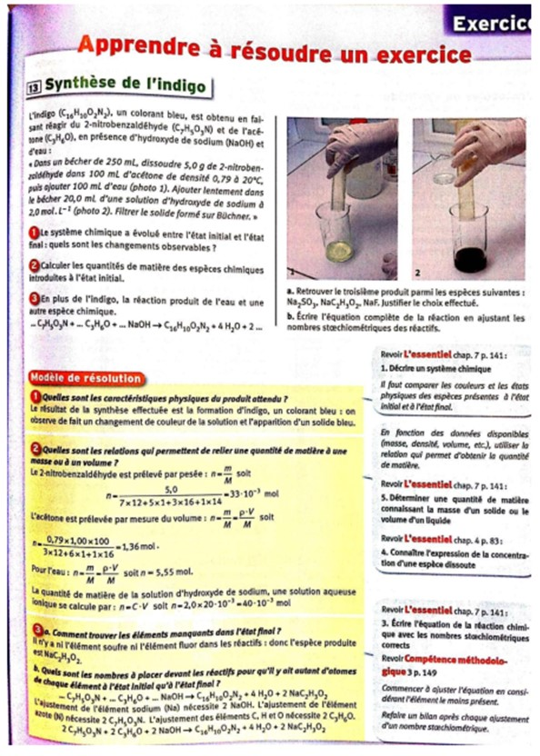
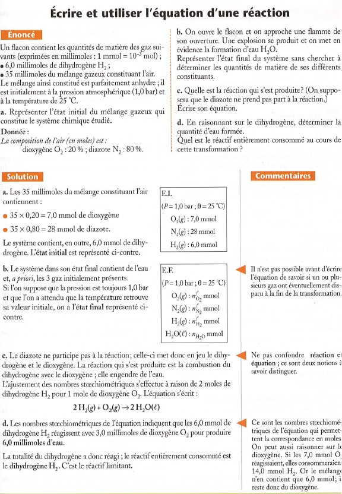

--- 
Title : Systèmes chimiques 
order : 100
---
## Système Chimique

Nous avons désormais tous les outils nécessaires pour une étude concrète et quantitative chimique. Mais il faut d’abord définir quelques notions de base, notamment celle d’un « système chimique », qui sera l’arène des réactions chimiques que nous étudierons.

!!!success **Définition : *Système Chimique***

Un système chimique est un ensemble d’espèces chimiques. Afin d’étudier la réaction chimique il faut déterminer l’état du système chimique, c’est-à-dire :

- La nature, et quantité de matière de chaque espèce

- L’état physique des espèces : solide (*s*), liquide ($\ell$), gazeux
  (*g*) ou aqueuse (*aq*).

- La température ($T$) et la pression ($P$) du système.
!!!

!!!success **Définition : *Naturel, synthétique, artificiel***

- Une espèce chimique est considérée **naturelle** si elle se forme dans la nature, sans intervention humaine (eg. eau formée dans la nature)

- Une espèce est dite **synthétique** si elle se forme grâce à l’intervention humaine. Elle peut être :

  - Une reproduction d’une espèce (eau formée par l’homme)

  - Une espèce chimique qui n’existe pas dans la nature (matières plastiques). Dans ce cas-là elle est nommée **artificielle**.

- La synthèse d’une espèce chimique est le fabrication de cette espèce par une transformation chimique.
!!!

**Quel est l’intérêt pour l’homme de sythétiser?**

- La synthèse permet d’obtenir, quand on la souhaite, une espèce chimique en grande quantité, ce qui est souvent plus économique que son extraction. (Exemple : )

- Elle permet aussi de fabriquer des produits chimiques qui n’existent pas dans la nature : **espèces artificielles**. (Exemple : )

Dans cette optique l’importance d’une connaissance quantitative ainsi qu’une compréhension qualitative des transformations chimiques, son EI et EF, les mesures précises des espèces avant et après la transformation, est évidente !!

==- [!Button Exercices Résolus]

==-