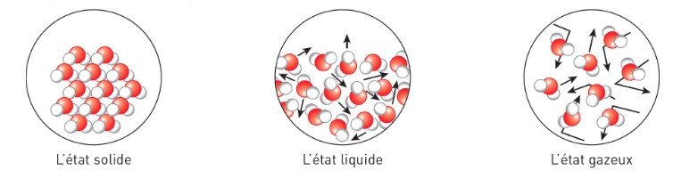
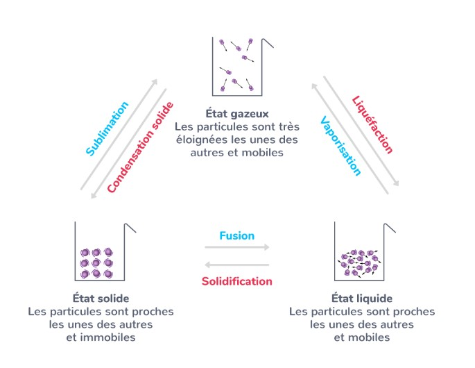

## Transformations physiques

Commençons par ce que vous connaissez bien déjà : les changements d’état de la matière. En effet, les changements d’état (que vous avez étudiés depuis longtemps) sont des transformations physiques.

!!!success **Définition : *Les états de la matière***

- La matière peut être dans l’un des trois états : solide ($s$), liquide ($\ell$), gazeux ($g$).

- Les états de matière dépendent de l’arrangement des particules constituant la substance et leur degré de liberté de mouvement 

- L’état de chaque substance dépend de sa *température*
!!!

!!!success**Définition : *Changement d’état(= phase transition)***

Un changement d’état est un réarrangement des entités chimiques (atomes, molécules, etc) dans un milieu, les unes par rapport aux autres, accompagné d’un changement de leur liberté de mouvement.
!!!

!!!light **Exemple:** écriture de l’état physique

- L’eau à l’état liquide : $H_2O_{(\ell)}$

- l’eau à l’état gazeux : $H_20_{(g)}$
!!!

!!!light **Exemple:** écriture de l’état physique 
Voici comment écrire l’équation modélisant un changement d’état (la vaporisation de l’eau): $H_2O_{(\ell)} \longrightarrow H_2O_{(g)}$

!!!

Afin de mieux étudier les transformations nucléaires, il faut développer une **façon de les écrire et de les modéliser**. Nous allons donc réutiliser la notation utilisée précédemment pour modéliser les noyaux atomiques dans le chapitre 1.

Toutefois il faut d’abord comprendre que la modélisation correcte de ces transformations dépend de deux lois de conservation :

- **Conservation de la masse** : Dans le cas des noyaux atomiques, ceci implique la **conservation du nombre de masse $A$**.

- **Conservation de la charge** : Dans le cas des noyaux atomiques, ceci implique la **conservation du numéro atomique $Z$**.

!!!success**Définition : *Ecriture d’une transformation nucléaire***  
Considérons les éléments chimiques , ,

- Pour noter une transformation nucléaire on utiliser une flèche $\longrightarrow$. e.g. :
  $$
  \ce{^{A}_{Z}W} \longrightarrow \ce{^{A'}_{Z'}X} + \ce{^{A''}_{Z''}Y}
  $$

- la conservation de masse implique : $A = A' + A''$

- la conservation de charge implique : $Z = Z' + Z''$

- de manière générale la somme des $A$ avant la flèche doit égaliser la somme des $A$ après la flèche. De même pour les numéros de charge $Z$.
!!!

De manière générale alors :

**Une désintagration :**
$\ce{^{A}_{Z}W} \longrightarrow \ce{^{A'}_{Z'}X} + \ce{^{A''}_{Z''}Y} \quad \text{avec}\quad
\begin{cases}
A = A' + A'' \\
Z = Z' + Z''
\end{cases}$

**Une fusion :**
$\ce{^{A}_{Z}W} + \ce{^{A'}_{Z'}X}  \longrightarrow \ce{^{A''}_{Z''}Y} \quad \text{avec}\quad
\begin{cases}
A + A' = A'' \\
Z + Z' = Z''
\end{cases}$

**Une fission :**
$\ce{^{A}_{Z}W} \longrightarrow \ce{^{A'}_{Z'}X} + \ce{^{A''}_{Z''}Y} \quad \text{avec}\quad
\begin{cases}
A = A' + A'' \\
Z = Z' + Z''
\end{cases}$

Voici un exemple de la réaction de fission qui a lieu au coeur des réacteurs nucléaires terrestres, qui est la source de leur énergie :

Voici un exemple de la réaction de fusion (thermonucléaire) qui a lieu au coeur des étoiles, qui est la source de leur énergie :

[!Button Exercices Résolus]

==-