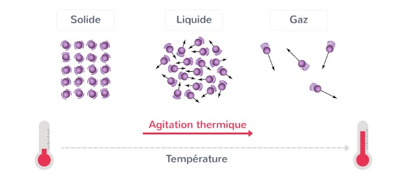
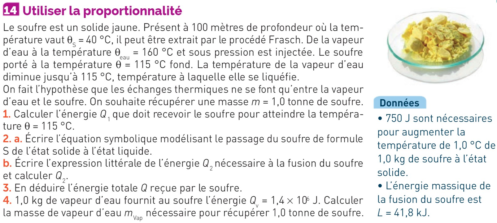
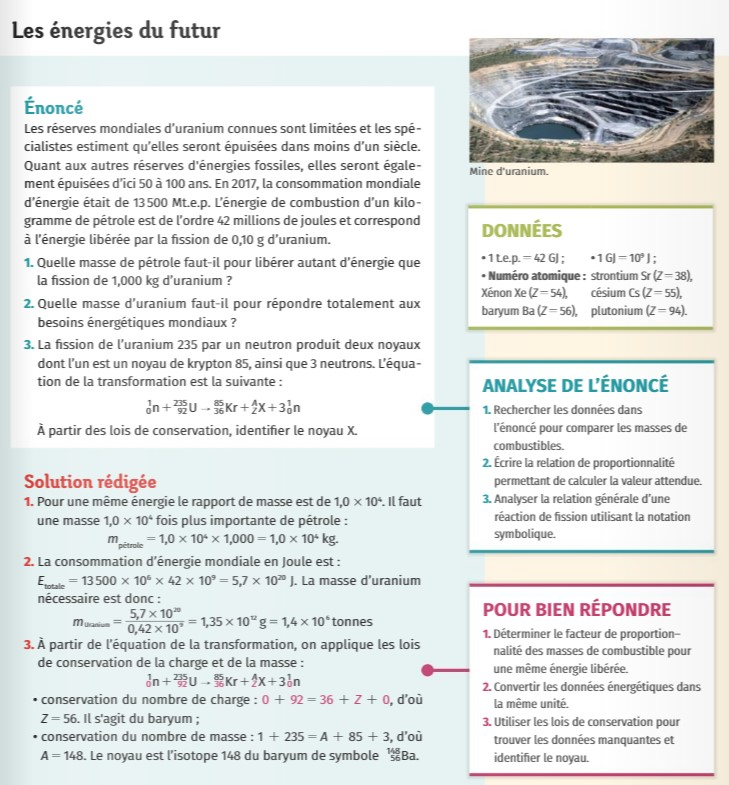

## Aspects énergétiques

Comme déjà mentionné précédemment l’état d’une substance et les changements d’état dépendent de la température.

!!!success **Définition : *Énergie d’une transformation***

- Une transformation pendant laquelle le système absorbe de la chaleur (l’énergie thermique) est appelée **endothermique**.

- Lors d’une transformation endothermique la **température du milieu diminue**.

- Une transformation pendant laquelle le système cède de la chaleur est appelée **exothermique**.

- Lors d’une transformation exothermique la **température du milieu augmente**.
!!!

On voit donc qu’une transformation telle que la fusion (solide $\rightarrow$ liquide) est une transformation endothermique, car pour qu’elle puisse avoir lieu il faut ‘injecter’ de l’énergie dans le solide en l’extrayant du milieu dans lequel le solide se trouve. Ceci explique pourquoi tenir un glaçon dans la main refroidit la main. Cela implique que la réaction inverse, la solidification, est une réaction exothermique : c’est le cas de l’eau qui gèle, cèdant de la chaleur vers l’extérieur.

Afin de mieux étudier les transformations nucléaires, il faut développer une **façon de les écrire et de les modéliser**. Nous allons donc réutiliser la notation utilisée précédemment pour modéliser les noyaux atomiques dans le chapitre 1.

Toutefois il faut d’abord comprendre que la modélisation correcte de ces transformations dépend de deux lois de conservation :

- **Conservation de la masse** : Dans le cas des noyaux atomiques, ceci implique la **conservation du nombre de masse $A$**.

- **Conservation de la charge** : Dans le cas des noyaux atomiques, ceci implique la **conservation du numéro atomique $Z$**.

!!!success**Définition : *Ecriture d’une transformation nucléaire***  
Considérons les éléments chimiques , ,

- Pour noter une transformation nucléaire on utiliser une flèche $\longrightarrow$. e.g. :
  $$
  \ce{^{A}_{Z}W} \longrightarrow \ce{^{A'}_{Z'}X} + \ce{^{A''}_{Z''}Y}
  $$

- la conservation de masse implique : $A = A' + A''$

- la conservation de charge implique : $Z = Z' + Z''$

- de manière générale la somme des $A$ avant la flèche doit égaliser la somme des $A$ après la flèche. De même pour les numéros de charge $Z$.
!!!

De manière générale alors :

**Une désintagration :**
$\ce{^{A}_{Z}W} \longrightarrow \ce{^{A'}_{Z'}X} + \ce{^{A''}_{Z''}Y} \quad \text{avec}\quad
\begin{cases}
A = A' + A'' \\
Z = Z' + Z''
\end{cases}$

**Une fusion :**
$\ce{^{A}_{Z}W} + \ce{^{A'}_{Z'}X}  \longrightarrow \ce{^{A''}_{Z''}Y} \quad \text{avec}\quad
\begin{cases}
A + A' = A'' \\
Z + Z' = Z''
\end{cases}$

**Une fission :**
$\ce{^{A}_{Z}W} \longrightarrow \ce{^{A'}_{Z'}X} + \ce{^{A''}_{Z''}Y} \quad \text{avec}\quad
\begin{cases}
A = A' + A'' \\
Z = Z' + Z''
\end{cases}$

Voici un exemple de la réaction de fission qui a lieu au coeur des réacteurs nucléaires terrestres, qui est la source de leur énergie :

Voici un exemple de la réaction de fusion (thermonucléaire) qui a lieu au coeur des étoiles, qui est la source de leur énergie :

[!Button Exercices Résolus]

==-