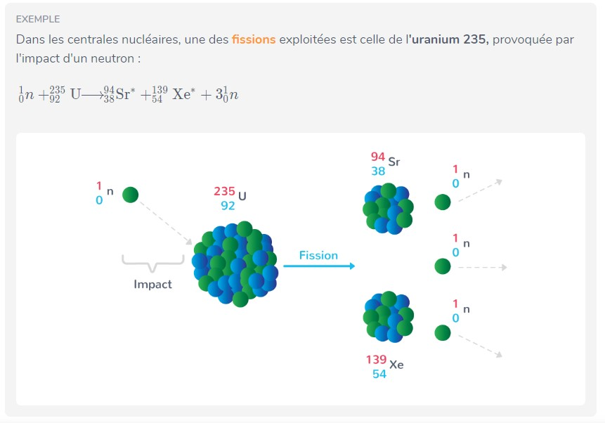
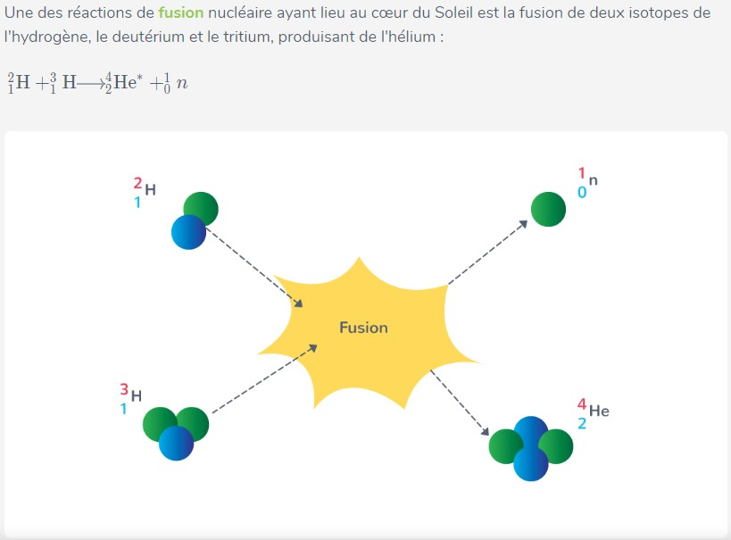

## Fission et Fusion : transformations nucléaires provoquées

La radioactivité n’est pas la seule transformation nucléaire possible. Il existe deux autres transformations, dites provoquées. Elles n’ont pas lieu au hasard, et l’on peut créer les conditions pour les provoquer.

!!!success**Définition : *Fission***

- Lors d’une fission, un noyau (lourd) d’un atome **se divise en deux** noyaux plus légers, souvent en raison d’un impact avec un neutron.

- Lors d’une fission, **une petite partie de la masse des protons et des neutrons est convertie en une grande quantité d’énergie**.

- la fission, est la réaction qui a lieu dans des centrales nucléaires civiles, ainsi que dans les armes nucléaires.

- Lors de la fission, il y a d’autres neutrons libérés qui vont, à leur tour, se heurter contre d’autres noyaux, provoquant leur fission et ainsi que la libération d’encore plus de neutrons, provoquant une **réaction en chaîne**. 
!!!

!!!success**Définition : *Fusion***

- Lors d’une fusion, **deux noyaux atomiques légers s’associent** pour former un nouveau noyau plus lourd.

- Lors d’une fusion, une petite partie de la masse des protons et neutrons est convertie en une grande quantité d’énergie.

- Afin qu’elle puisse avoir lieu, une fusion requiert un milieu de très haute température de pression pour que les noyaux puissent surmonter la répulsion électromagnétique des protons.
!!!

Afin de mieux étudier les transformations nucléaires, il faut développer une **façon de les écrire et de les modéliser**. Nous allons donc réutiliser la notation utilisée précédemment pour modéliser les noyaux atomiques dans le chapitre 1.

Toutefois il faut d’abord comprendre que la modélisation correcte de ces transformations dépend de deux lois de conservation :

- **Conservation de la masse** : Dans le cas des noyaux atomiques, ceci implique la **conservation du nombre de masse $A$**.

- **Conservation de la charge** : Dans le cas des noyaux atomiques, ceci implique la **conservation du numéro atomique $Z$**.

!!!success**Définition : *Ecriture d’une transformation nucléaire***  
Considérons les éléments chimiques , ,

- Pour noter une transformation nucléaire on utiliser une flèche $\longrightarrow$. e.g. :
  $$
  \ce{^{A}_{Z}W} \longrightarrow \ce{^{A'}_{Z'}X} + \ce{^{A''}_{Z''}Y}
  $$

- la conservation de masse implique : $A = A' + A''$

- la conservation de charge implique : $Z = Z' + Z''$

- de manière générale la somme des $A$ avant la flèche doit égaliser la somme des $A$ après la flèche. De même pour les numéros de charge $Z$.
!!!

De manière générale alors :

**Une désintagration :**
$\ce{^{A}_{Z}W} \longrightarrow \ce{^{A'}_{Z'}X} + \ce{^{A''}_{Z''}Y} \quad \text{avec}\quad
\begin{cases}
A = A' + A'' \\
Z = Z' + Z''
\end{cases}$

**Une fusion :**
$\ce{^{A}_{Z}W} + \ce{^{A'}_{Z'}X}  \longrightarrow \ce{^{A''}_{Z''}Y} \quad \text{avec}\quad
\begin{cases}
A + A' = A'' \\
Z + Z' = Z''
\end{cases}$

**Une fission :**
$\ce{^{A}_{Z}W} \longrightarrow \ce{^{A'}_{Z'}X} + \ce{^{A''}_{Z''}Y} \quad \text{avec}\quad
\begin{cases}
A = A' + A'' \\
Z = Z' + Z''
\end{cases}$

Voici un exemple de la réaction de fission qui a lieu au coeur des réacteurs nucléaires terrestres, qui est la source de leur énergie :

Voici un exemple de la réaction de fusion (thermonucléaire) qui a lieu au coeur des étoiles, qui est la source de leur énergie :

[!Button Exercices Résolus]
