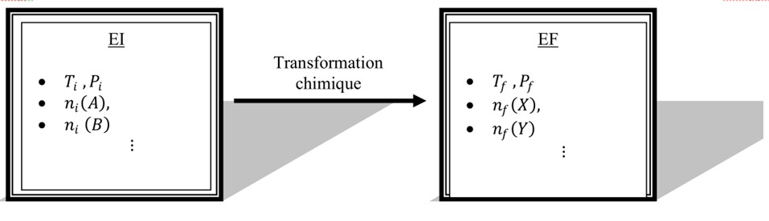
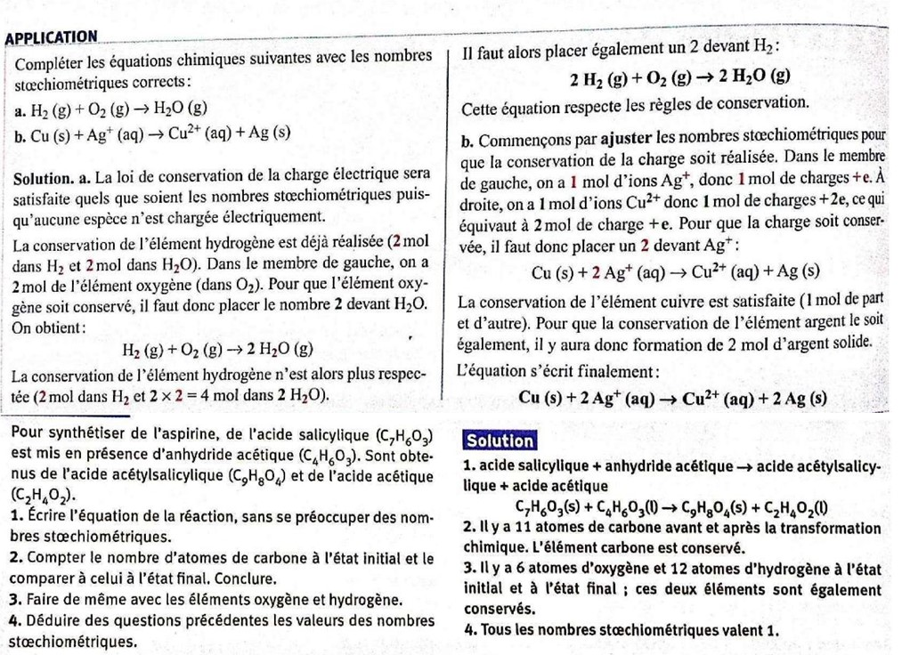
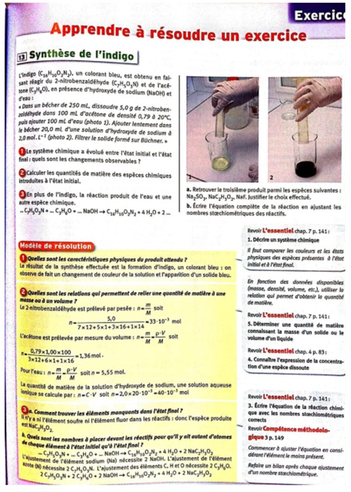
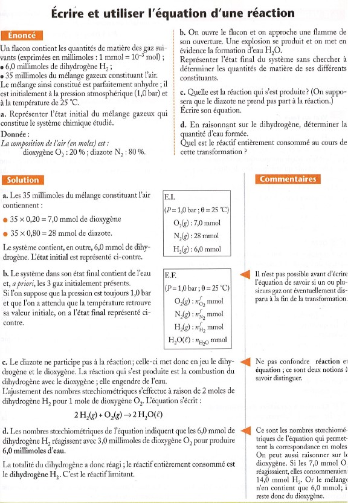
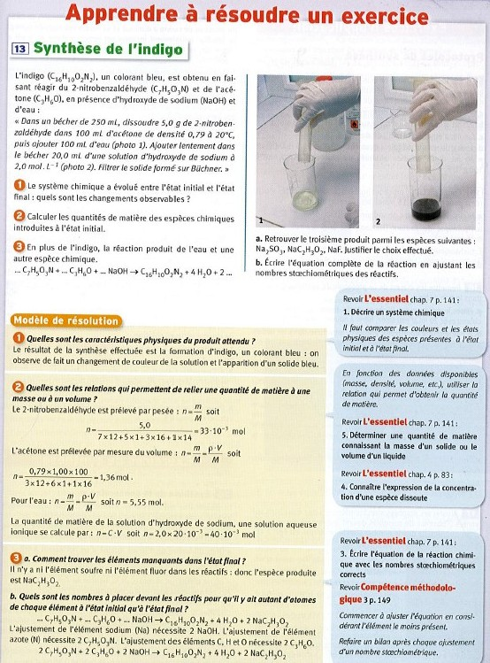

--- 
Title : Transformations chimiques 
order : 100
---
## Système Chimique

Nous avons désormais tous les outils nécessaires pour une étude concrète et quantitative chimique. Mais il faut d’abord définir quelques notions de base, notamment celle d’un « système chimique », qui sera l’arène des réactions chimiques que nous étudierons.

!!!success **Définition : *Système Chimique***

Un système chimique est un ensemble d’espèces chimiques. Afin d’étudier la réaction chimique il faut déterminer l’état du système chimique, c’est-à-dire :

- La nature, et quantité de matière de chaque espèce

- L’état physique des espèces : solide (*s*), liquide ($\ell$), gazeux
  (*g*) ou aqueuse (*aq*).

- La température ($T$) et la pression ($P$) du système.
!!!

## Transformations chimiques

!!!success **Définition : *Etats d’un système chimique***

- L’état initial (EI) d’un système chimique est l’état du système au moment de la mise en contact des réactifs. Il s’agit d’un état statique.

- L’état final (EF) d’uns système chimique est l’état dans lequel le système se trouve après la fin de son évolution (i.e. quand il n’y a plus de changement de quantité de matières des espèces présentes). Il s’agit d’un *état statique*. 

- Quand le système subit une telle évolution (i.e. passage d’un EI à un EF), on dit que le système a subit un *transformation chimique*.

- Les espèces présentes à l’EI qui seront consommées lors de la transformation s’appelle les réactifs. Le réactif qui s’épuise d’abord s’appelle le réactif limitant. Le(s) réactif(s) présents à l’EF s’appelle(nt) le(s) *réactif(s) en excès.
*
- Les espèces absentes à l’EI qui se forment lors de la transformation s’appelle les produits.

- Les espèces chimiques présentes qui ne participent pas à la réaction s’appellent les *spectateurs*.
!!!

Nous voyons donc que les méthodes de mesures de quantités exactes sont très impotantes. Révisons alors ces méthodes :

- **Notre meilleur ami (NMA)** : qui nous permet de mesurer une quantité de matière à partir d’une masse :
  $$
  n=\dfrac{m}{M} \quad \Longleftrightarrow m = n\cdot M 
  $$

- **Masse volumique** : Pour un corps liquide il est plus facile de mesurer un volume qu’une masse, il faut donc utiliser la masse volumique $\rho_x$ , ou sa densité $d_x$ :
  $$
  \rho_x = \dfrac{m_x}{V} \quad \begin{cases}
      m_x \longrightarrow\text{masse de la substance $x$} \\
      V \longrightarrow\text{volume que la masse occupe}
      \end{cases}
  $$
  $$
  d_x=\dfrac{\rho_x}{\rho_{eau}}
  $$

Nous avons donc :
  $$
  \rho_x = \dfrac{m_x}{V} = d_x\cdot \rho_{eau}
      \Longleftrightarrow m_x = d_x\cdot\rho_{eau}\cdot V
  $$
  et donc combiné avec NMA :
  $$
  n= \dfrac{d_x\cdot\rho_{eau}\cdot V}{M}
  $$

- **Dans le cas d’une solution** : en utilisant la **concentration**
  $$
  C=\dfrac{n}{V} \Longleftrightarrow n=C\cdot V \\
  $$
  $$
  C_m = \dfrac{m}{V}=\dfrac{n\cdot M}{V} \Longleftrightarrow n=\dfrac{C_m \cdot V}{M}
  $$

!!!warning **Remarque.** 
*La concentration massique d’une solution saturée s’appelle la *solubilité*, c’est-à-dire la quantité maximum de soluté que l’on peut dissoudre dans ce solvant*
!!!

### Réaction chimique

Afin de pouvoir étudier une transformation chimique on la modélise. Ce
modèle s’appelle une réaction chimique.

!!!success **Définition : *Réaction chimique***

- La **description à l’échelle macroscopique** de l’évolution d’un système chimique est **modélisée par une réaction chimique**

- Dans le modèle de la réaction chimique indique simplement **la nature des réactifs et des produits, ainsi que les proportions** dans lesquelles les réactifs réagissent et les produits se forment.

- L’équation chimique est l’écriture symbolique de la réaction chimique.

- Les nombres devant les symboles et les formules s’appellent les **coefficients stœchiométriques**, et représentent les proportions dans lesquelles réagissent les réactifs et se forment les réactifs.

- **Une réaction se termine** quand les quantités des réactifs et des produits cessent d’évoluer. Ceci est souvent du à l’épuisement d’un des réactifs.
!!!

!!!success **Définition : *Réactif limitant & réactif en excès***

- Le réactif qui s’épuise en premier s’appelle le **réactif limitant**.

- Le réactif restant apèrs la fin de réaction s’appelle le **réactif en excès**.

- Si à la fin de la réaction tous les réactifs sont épuisés, on dit qu’ils étaient présent en **proportions stœchiométrique**.
!!!

Alors, afin de pouvoir déterminer les proportions dans lesquelles les espèces réagissent et se forment, notre motivation principale sera le principe de la conservation de la matière, ou plus précisément :

- **Conservation des éléments chimiques** : il faut le même nombre de chaque atome présents à l’EI que l’on trouve à l’EF.

- **Conservation de la charge électrique** : (la charge totale) l’EI est conservée lors de la transformation chimique et donc est égale à la charge du système à l’EF.

Les proportions dans lesquelles les espèces réagissent ou se forment s’appellent les **nombres (ou coefficients) stoechiométriques**. La notation générale d’une réaction quelconque s’écrit :
$$
a\ch{A} + b\ch{B} \longrightarrow c\;\ch{C} + d\;\ch{D}
$$
$$
où \quad \begin{cases}
A,B,C,D \quad \quad \text{sont les symboles et formules chimiques des espèces} \\
a,b,c,d \quad \quad \text{sont les nombres stœchiométriques} 
\end{cases}
$$

!!!tip **Point Méthodologie**
Comment ajuster et équilibrer les nombre stœchiométriques:

1.  Identifier réactifs et produits en précisant leur état physique.

2.  Ecrire les formules brutes des différents constituants à gauche (réactifs) et à droite (produits).

3.  Compter tous les éléments de part et d’autre de la flèche.

    - s’il y a le même nombre d’éléments des deux côtés pour tous les éléments présents, alros les nombres stoechiométriques sonts ajustés. La lois de conservation des éléments est ainsi vérifiée.

    - Sinon, faire précéder les formules brutes du nombre stoechiométriques adapté pour vérifier la conservation des
      éléments et de la charge.

4.  Réécrire l’équation de la réaction avec les nombres stoechiométriques ajustés, puis vérifier la loi de conservation de la matière et de la charge.
!!!

+++ Enoncé
$\triangleright \quad$ Équilibrer les réactions
suivantes :

1.  $\quad\quad \ch{H2} \quad\quad+ \quad\quad \ch{O2}  \quad\quad \longrightarrow\quad\quad \ch{H2O}$

2.  $\quad\quad \ch{H2} \quad\quad+ \quad\quad \ch{N2}  \quad\quad \longrightarrow\quad\quad \ch{NH3}$

3.  $\quad\quad \ch{C2H5OH} \quad\quad+ \quad\quad \ch{O2} \quad\quad\longrightarrow\quad\quad \ch{CO2} \quad\quad+\quad\quad \ch{H2O}$

4.  $\quad\quad \ch{C8H18} \quad\quad+ \quad\quad \ch{O2}\quad\quad \longrightarrow\quad\quad \ch{CO2} \quad\quad+\quad\quad \ch{H2O}$

5.  $\quad\quad \ch{H2O} \quad\quad+ \quad\quad \ch{CO} \quad\quad + \quad\quad \ch{F2} \quad\quad+\quad\quad \longrightarrow\quad\quad\ch{C6H5F}\quad\quad  + \ch{O2}$
!!!
+++ solution
+++

### Aspects énergétique d’une réaction chimique

Les liaisons entre les atomes d’une molécules contiennent de l’énergie, c’est-à-dire afin de former ces liaison il à fallu dépenser de l’énergie. Cette énergie s’appelle **l’énergie de liaison**.

Lors d’une réaction chimique, les liaisons entre certains atomes sont brisés et d’autres se forment. Chaque fois qu’une liaison est brisée l’énergie qui y a été stockée est libérée, et pour chaque liaison formée il y a de l’énergie prise et stockée dans la liaison. Par conséquent à la fin de la réaction, en faisant le bilan de toutes les liaisons
brisées et formées nous pouvons voir que deux possibilités énergétiques existent :

- Il y a plus d’énergie libérée que stockée, et dans ce cas-là on parle d’une réaction exothermique. Une réaction exothermique est une réaction qui cède de la chaleur (énergie thermique) à l’extérieur (e.g. combustion)

- Il y a plus d’énergie stockée dans les liaisons que libérée et dans ce cas-là on parle d’uen réaction endothermique. Une réaction endothermique est une réaction qui prend de la chaleur de l’extérieur. (e.g. gel pack de refroidissement pour les blessures)

## Synthèse chimique

!!!success **Définition : *Naturel, synthétique, artificiel***

- Une espèce chimique est considérée **naturelle** si elle se forme dans la nature, sans intervention humaine (eg. eau formée dans la nature)

- Une espèce est dite **synthétique** si elle se forme grâce à l’intervention humaine. Elle peut être :

  - Une reproduction d’une espèce (eau formée par l’homme)

  - Une espèce chimique qui n’existe pas dans la nature (matières plastiques). Dans ce cas-là elle est nommée **artificielle**.

- La synthèse d’une espèce chimique est le fabrication de cette espèce par une transformation chimique.
!!!

**Quel est l’intérêt pour l’homme de sythétiser?**

- La synthèse permet d’obtenir, quand on la souhaite, une espèce chimique en grande quantité, ce qui est souvent plus économique que son extraction. (Exemple : )

- Elle permet aussi de fabriquer des produits chimiques qui n’existent pas dans la nature : **espèces artificielles**. (Exemple : )

Dans cette optique l’importance d’une connaissance quantitative ainsi qu’une compréhension qualitative des transformations chimiques, son EI et EF, les mesures précises des espèces avant et après la transformation, est évidente !!

==- [!Button Exercices Résolus]

==-