# Transformations de la matière

Quand nous parlons de la transformation de la matière, il faut préciser
à quel niveau la transformation a lieu. En général nous considérons
trois “niveaux” ou types de transformation. Ces transformations ont lieu
aux différentes échelles :

- **Transformations physiques** : à l’échelle des atomes et des
  molécules comme des entités

- **Transformations chimiques** : à l’échelle d’un atome ou d’une
  molécule individuelle. Ce sont des transformations concernant
  exclusivement les électrons et les couches électroniques.

- **Transformations nucléaires** : à l’échelle du noyau atomique et donc
  concernant les neutrons et les protons.

# Transformations physiques

Commençons par ce que vous connaissez bien déjà : les changements d’état
de la matière. En effet, les changements d’état (que vous avez étudiés
depuis longtemps) sont des transformations physiques.

<div class="leftbar">

**Définition : *Les états de la matière***

- La matière peut être dans l’un des trois états : solide ($`s`$),
  liquide ($`\ell`$), gazeux ($`g`$).

- Les états de matière dépendent de l’arrangement des particules
  constituant la substance et leur degré de liberté de mouvement (c.f.
  figure <a href="#fig:etats" data-reference-type="ref"
  data-reference="fig:etats">1</a>)

- L’état de chaque substance dépend de sa température

</div>

<figure id="fig:etats">
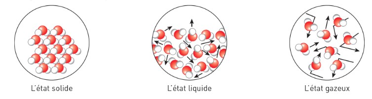
<figcaption>Les états de la matière</figcaption>
</figure>

<div class="leftbar">

**Définition : *Changement d’état<span style="color: purple">(= phase
transition</span>)***

- Un changement d’état est un réarrangement des entités chimiques
  (atomes, molécules, etc) dans un milieu, les unes par rapport aux
  autres, accompagné d’un changement de leur liberté de mouvement.

- les changements d’états sont résumés dans la figure
  <a href="#fig:etats2" data-reference-type="ref"
  data-reference="fig:etats2">2</a>

</div>

<figure id="fig:etats2">
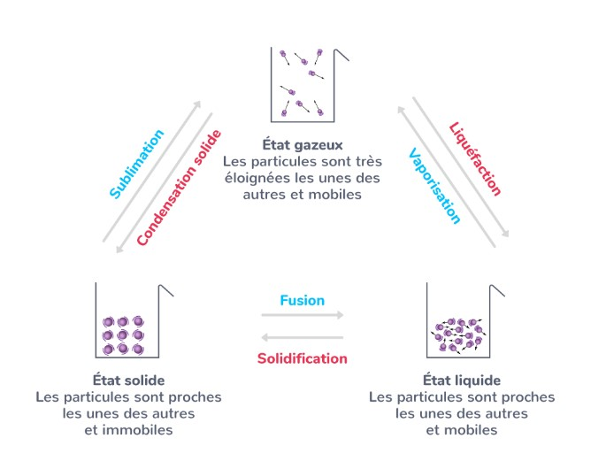
<figcaption>les changements d’état et les trois états de la
matière</figcaption>
</figure>

<div class="shaded">

**Exemple:** écriture de l’état physique

- L’eau à l’état liquide :

- l’eau à l’état gazeux :

</div>

<div class="shaded">

**Exemple:** écriture de l’état physique  
Voici comment écrire l’équation modélisant un changement d’état (la
vaporisation de l’eau): $`\longrightarrow`$

</div>

## Aspects énergétiques

Comme déjà mentionné précédemment l’état d’une substance et les
changements d’état dépendent de la température.

<figure>
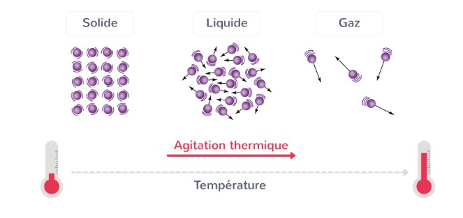
<figcaption>Rôle de la température dans les changements
d’état</figcaption>
</figure>

<div class="leftbar">

**Définition : *Énergie d’une transformation***

- Une transformation pendant laquelle le système absorbe de la chaleur
  (l’énergie thermique) est appelée **endothermique**.

- Lors d’une transformation endothermique la **température du milieu
  diminue**.

- Une transformation pendant laquelle le système cède de la chaleur est
  appelée **exothermique**.

- Lors d’une transformation exothermique la **température du milieu
  augmente**.

</div>

On voit donc qu’une transformation telle que la fusion (solide
$`\rightarrow`$ liquide) est une transformation endothermique, car pour
qu’elle puisse avoir lieu il faut ‘injecter’ de l’énergie dans le solide
en l’extrayant du milieu dans lequel le solide se trouve. Ceci explique
pourquoi tenir un glaçon dans la main refroidit la main. Cela implique
que la réaction inverse, la solidification, est une réaction
exothermique : c’est le cas de l’eau qui gèle, cèdant de la chaleur vers
l’extérieur.

## Énergie de changement d’état

<figure id="fig:courbefusion">
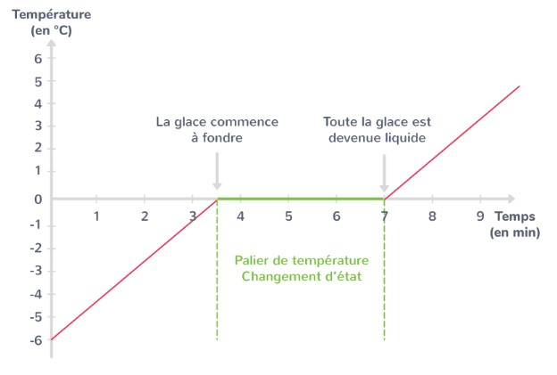
<figcaption>Évolution de la température d’une glaçon en fonction du
temps</figcaption>
</figure>

Vous Souvenez-vous de l’expérience de la fonte d’un glaçon en cinquième?
Vous aviez suivi la température d’un glaçon lors de sa fusion. La figure
<a href="#fig:courbefusion" data-reference-type="ref"
data-reference="fig:courbefusion">3</a> représente l’évolution de la
température du glaçon lors de sa fusion. Nous observons un palier très
caractéristique à la température de fusion. L’interprétation de ce
palier est : au début du palier il y a de l’eau solide à $`0\degree`$ et
à la fin du palier il y a de l’eau liquide à $`0\degree`$. Conclusion :
l’eau à l’état liquide a plus d’énergie que l’eau à la même température
à l’état solide.

Ce palier représente *l’énergie de changement d’état*, c’est à dire la
quantité d’énergie transférée pour que le corps change d’état (ici de
solide en liquide). Cependant, le plus souvent, l’énergie de changement
d’état est exprimée en terme d’**énergie *massique* de changement
d’état**

<div class="leftbar">

**Définition : *Énergie massique de changement d’état
<span style="color: purple">(= latent heat</span>)***

- C’est la quantité d’énergie nécessaire pour un changement d’état de
  $`1\; kg`$ d’un corps.

- Elle est notée $`E_{\text{changement d'état}}`$, et s’exprime en
  $`J\cdot kg^{-1}`$

- Elle peut être appelée aussi :

  - **Chaleur latente**, notée $`L_{\text{changement d'état}}`$

  - **Enthalpie** de changement d’état, notée
    $`\Delta H_{\text{changement d'état}}`$

- Elle est notée **positive** si la transformation est **endothermique**
  (car le transfert thermique s’effectue du milieu vers le corps,
  **entrant** dans le corps alors).

- Elle est notée **négative** si la transformation est **exothermique**
  (car le transfert thermique s’effectue du corps vers le milieu,
  **quittant** le corps alors).

</div>

<div class="shaded">

**Exemple:**

- Pour l’eau
  $`E_{\text{solidification}} = - 3,33\cdot 10^{5}\; J\cdot kg^{-1}`$

- $`E_{\text{fusion}} > 0`$

- $`E_{\text{solidification}} < 0`$

- $`E_{\text{solidification}} = - E_{\text{fusion}}`$

</div>

Pour finir, il est important de faire la **distinction donc entre
l’énergie de changement d’état et l’énergie massique de changement
d’état**. La première est la **quantité totale d’énergie** transférée
pour faire la transformation (dépendant donc de la quantité de matière à
transformer), tandis que la seconde est une **caractéristique** de la
substance, c’est à dire **une propriété de la matière** (et indépendante
de la masse).

Il existe donc une relation très simple entre l’énergie de changement
d’état noté $`Q`$, et l’énergie massique de changement d’état $`L`$ :
``` math
Q = m\cdot L
```

<div class="shaded">

$`\triangleright \quad`$**Exercice .** Déterminer l’énergie nécessaire
pour faire fondre $`250\; g`$ de glace. (Donnée :
$`L_{\text{fusion}}(eau) = 3,33\cdot 10^{5}\; J\cdot kg^{-1}`$

</div>

# Transformations nucléaires

## Radioactivité : Une transformation nucléaire spontanée

La dernières transformations qui nous intéressent sont les
transformations nucléaires. Nous parlons ici donc des interactions au
niveau du noyau atomique, c’est à dire des interactions entre les
protons et les neutrons principalement.

Sans entrer trop dans les détails, rappelons-nous que les protons sans
chargés positivement et donc se repoussent à cause de l’interaction
électrostatique. C’est pourquoi il faut des neutrons **afin que le noyau
garde sa cohésion**.

Il existe une interaction encore plus importante et forte entre les
protons et les neutrons (avec le nom très original de l’*interaction
forte*) qui est comme une sorte de colle encore plus puissante que la
répulsion électrostatique.

Le noyau a donc plus ou moins de stabilité en fonction du nombre de
protons et de neutrons. Que se passe-t-il si cette proportions change?
Le noyau peut devenir moins stable. Un noyau instable a tendance à se
désintégrer spontanément : c’est la ***radioactivité***.

<figure>
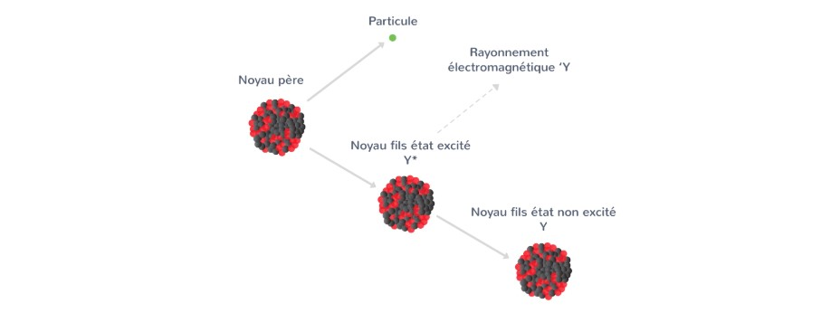
</figure>

Comme vous pouvez l’imaginer, pour un atome, certains isotopes sont plus
ou moins radioactifs que d’autres. De plus, les atomes les plus légers
sont les plus stables et plus un atome est lourd (surtout à partir de
l’élément Fer) plus il a d’isotopes radioactifs, l’exemple classique
étant un élément comme l’uranium ($`Z=92`$, avec plusieurs isotopes
$`U-234`$, $`U-235`$, $`U-238`$, $`U-239`$, ...).

<div class="leftbar">

**Définition : *Radioactivité***

- La radioactivité est le phénomène lié à la stabilité et à la
  désintégration spontanée des noyaux atomiques instables.

- L’instabilité d’un noyau peut être due à un excès de protons par
  rapport au nombre de neutrons, mais aussi à un excès de neutrons par
  rapport aux protons.

- En raison de la radioactivité, un élément chimique peut se transformer
  en d’autres éléments.

</div>

Voici **les trois types de radioactivité** dans la nature :

<figure>
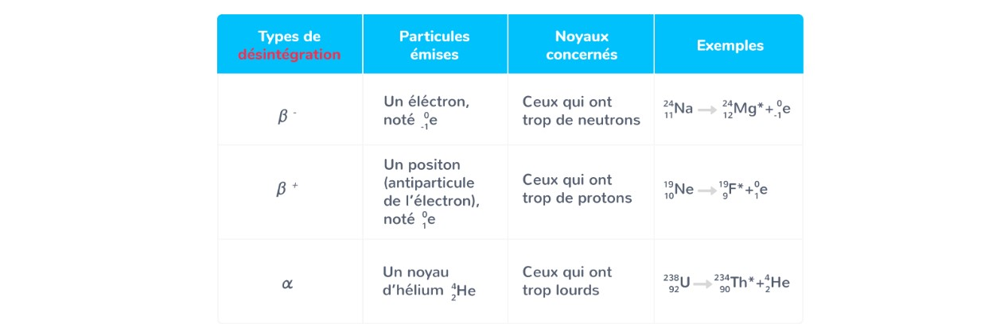
</figure>

## Fission et Fusion : transformations nucléaires provoquées

La radioactivité n’est pas la seule transformation nucléaire possible.
Il existe deux autres transformations, dites provoquées. Elles n’ont pas
lieu au hasard, et l’on peut créer les conditions pour les provoquer.

<figure>
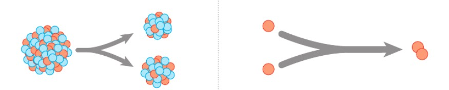
<figcaption>Fission à gauche, et Fusion à droite</figcaption>
</figure>

<div class="leftbar">

**Définition : *Fission***

- Lors d’une fission, un noyau (lourd) d’un atome **se divise en deux**
  noyaux plus légers, souvent en raison d’un impact avec un neutron.

- Lors d’une fission, **une petite partie de la masse des protons et des
  neutrons est convertie en une grande quantité d’énergie**.

- la fission, est la réaction qui a lieu dans des centrales nucléaires
  civiles, ainsi que dans les armes nucléaires.

- Lors de la fission, il y a d’autres neutrons libérés qui vont, à leur
  tour, se heurter contre d’autres noyaux, provoquant leur fission et
  ainsi que la libération d’encore plus de neutrons, provoquant une
  **réaction en chaîne**<span style="color: purple">(= chain
  reaction</span>).

</div>

<div class="leftbar">

**Définition : *Fusion***

- Lors d’une fusion, **deux noyaux atomiques légers s’associent** pour
  former un nouveau noyau plus lourd.

- Lors d’une fusion, une petite partie de la masse des protons et
  neutrons est convertie en une grande quantité d’énergie.

- Afin qu’elle puisse avoir lieu, une fusion requiert un milieu de très
  haute température de pression pour que les noyaux puissent surmonter
  la répulsion électromagnétique des protons.

</div>

## Écriture d’une réaction nucléaire

Afin de mieux étudier les transformations nucléaires, il faut développer
une **façon de les écrire et de les modéliser**. Nous allons donc
réutiliser la notation utilisée précédemment pour modéliser les noyaux
atomiques dans le chapitre 1.

Toutefois il faut d’abord comprendre que la modélisation correcte de ces
transformations dépend de deux lois de conservation :

- **Conservation de la masse** : Dans le cas des noyaux atomiques, ceci
  implique la **conservation du nombre de masse $`A`$**.

- **Conservation de la charge** : Dans le cas des noyaux atomiques, ceci
  implique la **conservation du numéro atomique $`Z`$**.

<div class="leftbar">

**Définition : *Ecriture d’une transformation nucléaire***  
  
Considérons les éléments chimiques , ,

- Pour noter une transformation nucléaire on utiliser une flèche
  $`\longrightarrow`$. e.g. :
  ``` math
  \ce{^{A}_{Z}W} \longrightarrow \ce{^{A'}_{Z'}X} + \ce{^{A''}_{Z''}Y}
  ```

- la conservation de masse implique : $`A = A' + A''`$

- la conservation de charge implique : $`Z = Z' + Z''`$

- de manière générale la somme des $`A`$ avant la flèche doit égaliser
  la somme des $`A`$ après la flèche. De même pour les numéros de charge
  $`Z`$.

- 

</div>

De manière générale alors :

**Une désintagration :**
$`\ce{^{A}_{Z}W} \longrightarrow \ce{^{A'}_{Z'}X} + \ce{^{A''}_{Z''}Y} \quad \text{avec}\quad
\begin{cases}
A = A' + A'' \\
Z = Z' + Z''
\end{cases}`$

**Une fusion :**
$`\ce{^{A}_{Z}W} + \ce{^{A'}_{Z'}X}  \longrightarrow \ce{^{A''}_{Z''}Y} \quad \text{avec}\quad
\begin{cases}
A + A' = A'' \\
Z + Z' = Z''
\end{cases}`$

**Une fission :**
$`\ce{^{A}_{Z}W} \longrightarrow \ce{^{A'}_{Z'}X} + \ce{^{A''}_{Z''}Y} \quad \text{avec}\quad
\begin{cases}
A = A' + A'' \\
Z = Z' + Z''
\end{cases}`$

Voici un exemple de la réaction de fission qui a lieu au coeur des
réacteurs nucléaires terrestres, qui est la source de leur énergie :

<figure>
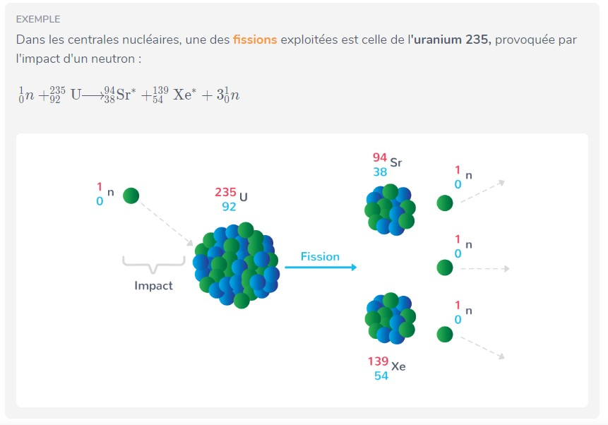
</figure>

Voici un exemple de la réaction de fusion (thermonucléaire) qui a lieu
au coeur des étoiles, qui est la source de leur énergie :

<figure>

</figure>

# Exercices corrigés

<figure>
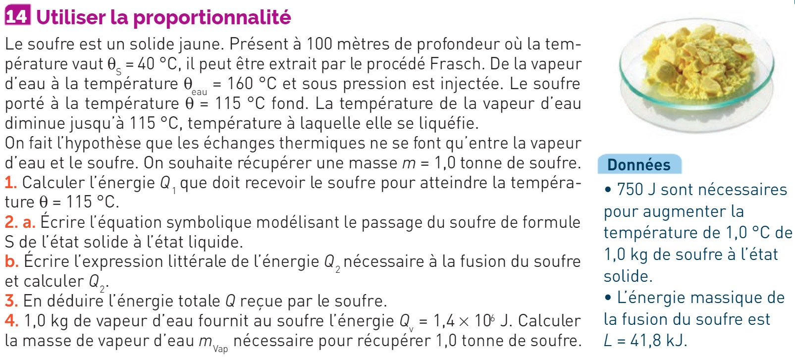
</figure>

<figure>
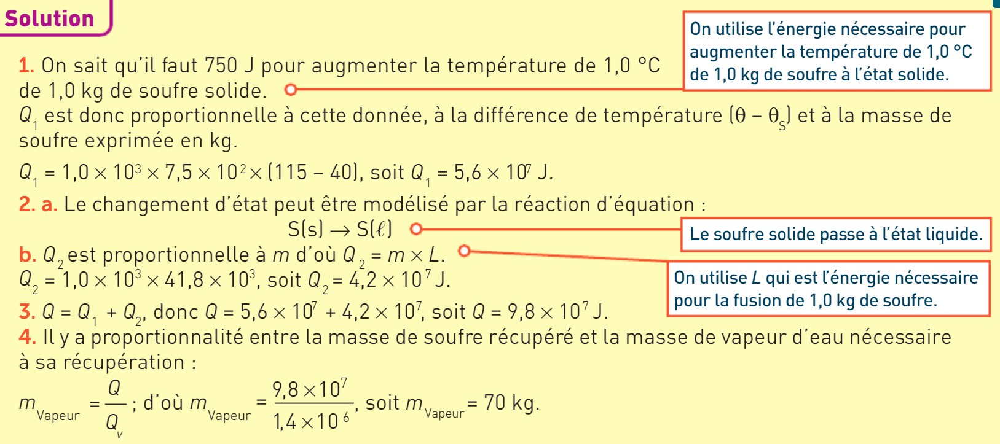
</figure>

<figure>
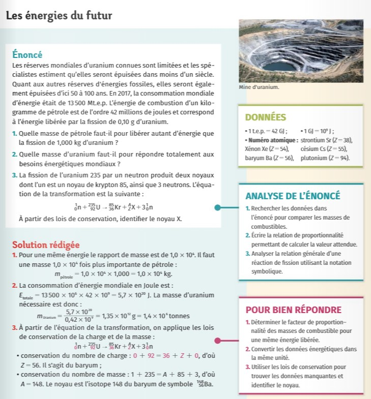
</figure>
